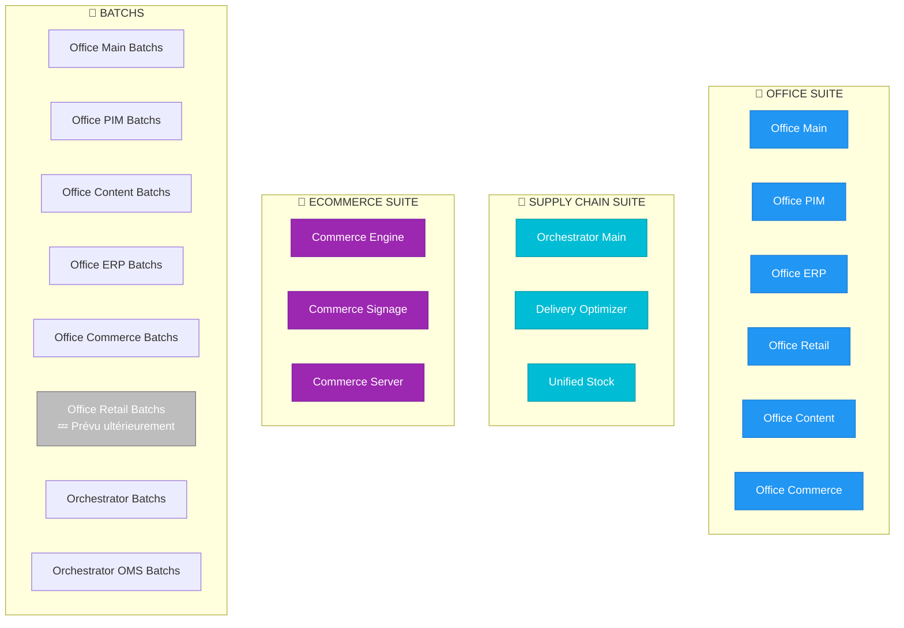
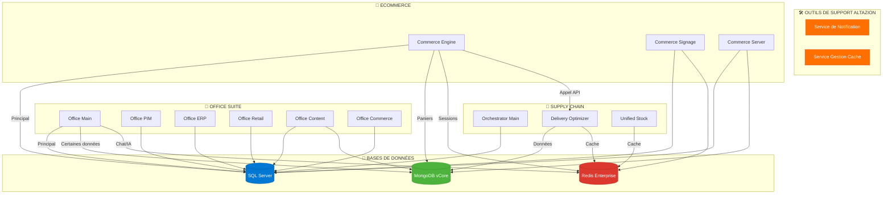

# Architecture Logique - Plateforme Altazion SaaS

> Documentation de l'architecture fonctionnelle et logique de la plateforme Altazion SaaS.

---

## Vue d'ensemble

Cette plateforme déploie une solution SaaS complète pour la gestion retail, e-commerce et supply chain. L'architecture est organisée en **3 suites applicatives** principales supportées par des **services de données** et des **outils transverses**.

## Architecture Logique - Niveau 1 : Applications Métier

---

## Architecture Logique - Niveau 2 : Support & Infrastructure

---

## Détail des Composants

### Office Suite (Back-Office)

| Composant | Description | Image Docker | Dépendances |
|-----------|-------------|--------------|-------------|
| **Office Main** | Point d'entrée principal du back-office | `altazion-office-main` | SQL (principal), MongoDB (certaines données), Redis (chat/IA) |
| **Office PIM** | Gestion des articles et catalogue produits | `altazion-office-pim` | SQL Server |
| **Office ERP** | Gestion de l'entreprise (finances, RH, etc.) | `altazion-office-erp` | SQL Server |
| **Office Retail** | Back-office pour la gestion des magasins | `altazion-office-retail` | SQL Server |
| **Office Content** | Gestion du contenu headless (CMS) | `altazion-office-content` | SQL Server, MongoDB |
| **Office Commerce** | Back-office pour le e-commerce | `altazion-office-commerce` | SQL Server |

**Batchs associés :** Office Main Batchs, Office PIM Batchs, Office Content Batchs, Office ERP Batchs, Office Commerce Batchs, Office Retail Batchs *(prévu ultérieurement)*

---

### Supply Chain Suite (Orchestration Logistique)

| Composant | Description | Image Docker | Dépendances |
|-----------|-------------|--------------|-------------|
| **Orchestrator Main** | Back-office logistique et orchestration principale | `altazion/orchestrator-main` | SQL Server |
| **Delivery Optimizer** | Optimisation des livraisons et routage | `altazion/delivery-optimizer` | MongoDB vCore, Redis Enterprise |
| **Unified Stock** | Gestion unifiée des stocks multicanaux | `altazion/oms-unifiedstock` | Redis Enterprise |

**Batchs associés :** Orchestrator Batchs (pour les 3 composants), Orchestrator OMS Batchs (progression commandes/bons de préparation)

---

### ECommerce Suite (Front-End Commerce)

| Composant | Description | Image Docker | Dépendances |
|-----------|-------------|--------------|-------------|
| **Commerce Engine** | Moteur e-commerce headless (API) | `altazion-commerce-engine` | SQL (principal), MongoDB (paniers), Redis (sessions), Delivery Optimizer (API) |
| **Commerce Signage** | Vente sur devices digitaux en magasin (bornes, affichage) | | SQL Server, Redis |
| **Commerce Server** | Couche de rendu côté serveur (SSR) | | SQL Server, MongoDB |

**Batchs associés :** Aucun prévu pour l'instant

---

### Bases de Données & Cache

| Service | Usage | Composants utilisateurs |
|---------|-------|-------------------------|
| **MongoDB vCore** | Stockage NoSQL pour paniers, certaines données | Delivery Optimizer, Office Main, Office Content, Commerce Engine, Commerce Server |
| **Redis Enterprise** | Cache haute performance, sessions, chat/IA | Unified Stock, Delivery Optimizer, Office Main (chat/IA), Commerce Engine (sessions), Commerce Signage |
| **SQL Server** | Base de données transverse principale | Presque tous les composants Office, Supply Chain et ECommerce |

---

### Outils de Support Altazion

| Outil | Description | Image Docker | Dépendances |
|-------|-------------|--------------|-------------|
| **Service de Notification** | Gestion des notifications de changement (type Service Bus/Kafka/NATS) | `altazion-internal-notifapp` | |
| **Service Gestion Cache** | Gestion centralisée du cache Redis | `altazion-redis-cachetools` | Redis Enterprise, SQL Server |

---

*Documentation logique maintenue par l'équipe DevOps Altazion*
*Dernière mise à jour : 5 janvier 2026*

