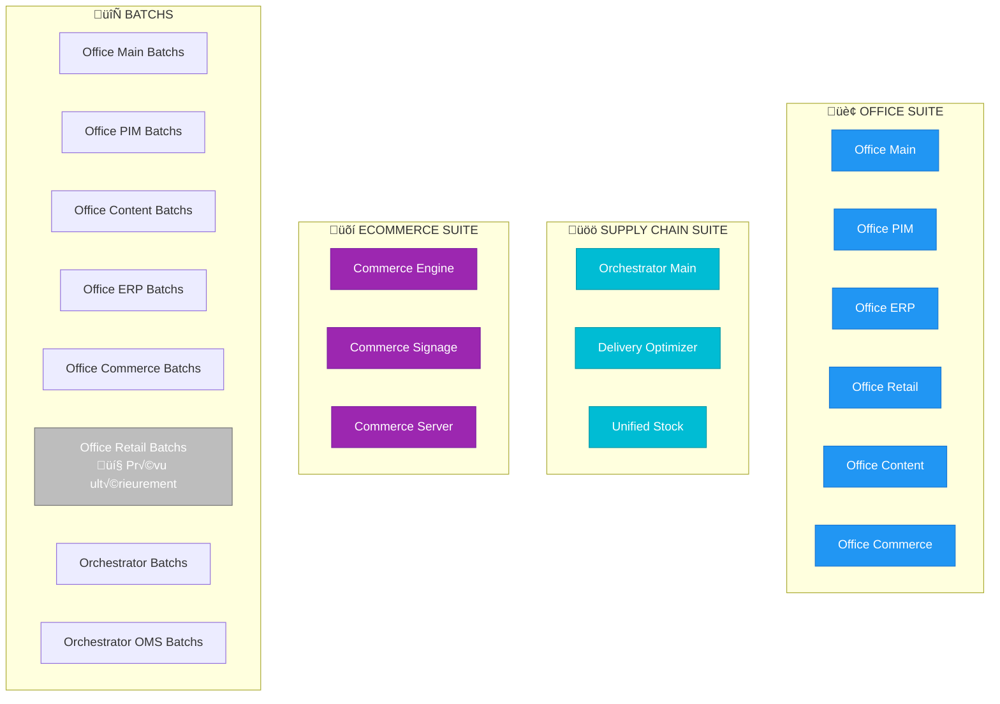

# Architecture Logique - Plateforme Altazion SaaS

> Documentation de l'architecture fonctionnelle et logique de la plateforme Altazion SaaS.

---

## Vue d'ensemble

Cette plateforme déploie une solution SaaS complète pour la gestion retail, e-commerce et supply chain. L'architecture est organisée en **3 suites applicatives** principales supportées par des **services de données** et des **outils transverses**.

## Architecture Logique - Niveau 1 : Applications Métier

---

## Architecture Logique - Niveau 2 : Support & Infrastructure

```mermaid
graph TB
    subgraph "💾 BASES DE DONNÉES"
        MONGO[(MongoDB vCore)]
        REDIS[(Redis Enterprise)]
        SQL[(SQL Server)]
    end

    subgraph "🛠️ OUTILS DE SUPPORT ALTAZION"
        NOTIF[Service de Notification]
        CACHE[Service Gestion Cache]
    end

    subgraph "🏢 OFFICE SUITE"
        OM[Office Main]
        OPIM[Office PIM]
        OERP[Office ERP]
        ORET[Office Retail]
        OCONT[Office Content]
        OCOM[Office Commerce]
    end

    subgraph "🚚 SUPPLY CHAIN"
        OMAIN[Orchestrator Main]
        DELIV[Delivery Optimizer]
        USTOCK[Unified Stock]
    end

    subgraph "🛒 ECOMMERCE"
        CENG[Commerce Engine]
        CSIGN[Commerce Signage]
        CSERV[Commerce Server]
    end

    %% Connexions Office
    OM -->|Principal| SQL
    OM -->|Certaines données| MONGO
    OM -->|Chat/IA| REDIS
    
    OPIM --> SQL
    OERP --> SQL
    ORET --> SQL
    OCONT --> SQL
    OCONT --> MONGO
    OCOM --> SQL

    %% Connexions Supply Chain
    OMAIN --> SQL
    DELIV -->|Données| MONGO
    DELIV -->|Cache| REDIS
    USTOCK -->|Cache| REDIS

    %% Connexions ECommerce
    CENG -->|Principal| SQL
    CENG -->|Paniers| MONGO
    CENG -->|Sessions| REDIS
    CENG -->|Appel API| DELIV
    
    CSIGN --> SQL
    CSIGN --> REDIS
    
    CSERV --> SQL
    CSERV --> MONGO

    %% Style des bases de données
    style MONGO fill:#4DB33D,stroke:#3E8E2E,color:#fff
    style REDIS fill:#DC382D,stroke:#B02A21,color:#fff
    style SQL fill:#0078D4,stroke:#005A9E,color:#fff
    
    style NOTIF fill:#FF6F00,stroke:#E65100,color:#fff
    style CACHE fill:#FF6F00,stroke:#E65100,color:#fff
```

---

## Détail des Composants

### Office Suite (Back-Office)

| Composant | Description | Image Docker | Dépendances |
|-----------|-------------|--------------|-------------|
| **Office Main** | Point d'entrée principal du back-office | `altazion-office-main` | SQL (principal), MongoDB (certaines données), Redis (chat/IA) |
| **Office PIM** | Gestion des articles et catalogue produits | `altazion-office-pim` | SQL Server |
| **Office ERP** | Gestion de l'entreprise (finances, RH, etc.) | `altazion-office-erp` | SQL Server |
| **Office Retail** | Back-office pour la gestion des magasins | `altazion-office-retail` | SQL Server |
| **Office Content** | Gestion du contenu headless (CMS) | `altazion-office-content` | SQL Server, MongoDB |
| **Office Commerce** | Back-office pour le e-commerce | `altazion-office-commerce` | SQL Server |

**Batchs associés :** Office Main Batchs, Office PIM Batchs, Office Content Batchs, Office ERP Batchs, Office Commerce Batchs, Office Retail Batchs *(prévu ultérieurement)*

---

### Supply Chain Suite (Orchestration Logistique)

| Composant | Description | Image Docker | Dépendances |
|-----------|-------------|--------------|-------------|
| **Orchestrator Main** | Back-office logistique et orchestration principale | `altazion/orchestrator-main` | SQL Server |
| **Delivery Optimizer** | Optimisation des livraisons et routage | `altazion/delivery-optimizer` | MongoDB vCore, Redis Enterprise |
| **Unified Stock** | Gestion unifiée des stocks multicanaux | `altazion/oms-unifiedstock` | Redis Enterprise |

**Batchs associés :** Orchestrator Batchs (pour les 3 composants), Orchestrator OMS Batchs (progression commandes/bons de préparation)

---

### ECommerce Suite (Front-End Commerce)

| Composant | Description | Image Docker | Dépendances |
|-----------|-------------|--------------|-------------|
| **Commerce Engine** | Moteur e-commerce headless (API) | `altazion-commerce-engine` | SQL (principal), MongoDB (paniers), Redis (sessions), Delivery Optimizer (API) |
| **Commerce Signage** | Vente sur devices digitaux en magasin (bornes, affichage) | | SQL Server, Redis |
| **Commerce Server** | Couche de rendu côté serveur (SSR) | | SQL Server, MongoDB |

**Batchs associés :** Aucun prévu pour l'instant

---

### Bases de Données & Cache

| Service | Usage | Composants utilisateurs |
|---------|-------|-------------------------|
| **MongoDB vCore** | Stockage NoSQL pour paniers, certaines données | Delivery Optimizer, Office Main, Office Content, Commerce Engine, Commerce Server |
| **Redis Enterprise** | Cache haute performance, sessions, chat/IA | Unified Stock, Delivery Optimizer, Office Main (chat/IA), Commerce Engine (sessions), Commerce Signage |
| **SQL Server** | Base de données transverse principale | Presque tous les composants Office, Supply Chain et ECommerce |

---

### Outils de Support Altazion

| Outil | Description | Image Docker | Dépendances |
|-------|-------------|--------------|-------------|
| **Service de Notification** | Gestion des notifications de changement (type Service Bus/Kafka/NATS) | `altazion-internal-notifapp` | |
| **Service Gestion Cache** | Gestion centralisée du cache Redis | `altazion-redis-cachetools` | Redis Enterprise, SQL Server |

---

*Documentation logique maintenue par l'équipe DevOps Altazion*
*Dernière mise à jour : 5 janvier 2026*

