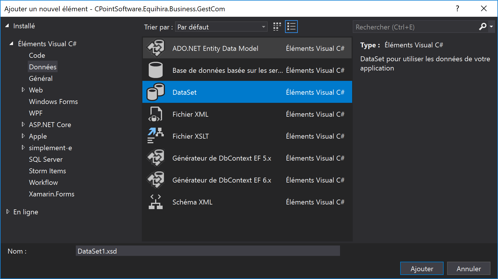

# Framework d'accés aux données

Pour accéder aux données, vous devez utiliser, autant que possible, le framework 'DataManager'. Celui-ci vous permet de réaliser des opérations de select, d'update, etc.

## Principes d'accès

Le framework d'accès aux données met à disposition plusieurs classes, dont la principale, `DataManager`, permet d'exécuter des requêtes et autres opérations sur la base. Ce framework étant assez ancien, il utilise des objets de type `DataSet` (voir ci-dessous) pour stocker les données en mémoire.

Pour utiliser le framework afin d'accéder au données, vous devez commencer par obtenir un objet de type `DataManager` en appelant la méthode static `GetDataManager()`  (vous pouvez, éventuellement, lui passer un nom de connexion). Il s'agit d'un [Design pattern de type Factory](https://fr.wikipedia.org/wiki/Fabrique_(patron_de_conception)) classique qui utilise un système de configuration décrit ci-dessous.

    using CPointSoftware.Framework.DataLayer;

    ...

    var dm = DataManager.GetDataManager();
    dm.Execute("...");

> [!Important]
> Dans le cadre de son utilisation dans les solutions dérivées de Equihira (Phygital, e-commerce, StoreServer, etc.), la majorité des accès à la base de données sera réalisée au sein [d'objets contenant toute la logique métier](technique-modele-architecture.md), dont la classe de base propose une propriété `MyDataManager` permettant d'accèder à un objet `DataManager` connecté sur la bonne base de données.

La classe retournée par la méthode `GetDataManager()` sera spécifique au serveur de base de données et à la technologie d'accès utilisé. Le module de base du framework permet de se connecter à des bases :
- SQL Server, via un accès client natif
- SQL Server Compact Edition
- Toute base gérée par OleDb

Il existe aussi des extensions pour Oracle et PostgreSql.

### Récupération de données

La récupération de données peut se faire via deux méthodes :
- pour charger des données de taille réduite en mémoire, vous pouvez utiliser directement l'une des surcharge de la méthode `Load` qui permet de remplir un objet de type `DataSet`
- si vous avez un flux de données plus conséquent et souhaitez utiliser une notion de curseur, vous pouvez utiliser l'une des méthodes `Open` pour charger des données par "paquet".

Pour l'une et l'autre des méthodes, il existe deux grandes catégories de surcharges :
- Les méthodes acceptant en paramètres une `DataTable` et un ensemble de `QueryClause` génère une requête Sql dynamique et sont utilisés lorsque les données à récupérer sont d'une nature assez simple
- celles acceptant en premier paramètre une requête SQL sous forme d'une `string`.

Le code suivant :

    var dm = DataManager.GetDataManager();
    var ds = new MonDataSet();

    dm.Load(ds.MaTable,
        new WhereClause("colonne1","=","valeur1"))

charge dans la table `MaTable`, toutes les lignes de la base de données ayant `valeur1` dans la `colonne1`.

> [!NOTE]
> Toutes les limitations ajoutées via l'utilisation de `WhereClause` sont transformée en _clauses avec paramètres_. L'exemple ci-dessous se transcrit sous la forme `WHERE colonne1 = @where1`, limitant ainsi les risques d'injection SQL.

Les différentes utilisations du `WhereClause` sont :

- `new WhereClause(colonne, operateur, valeur)` ajoute une entrée dans les clauses `WHERE` de la requête. Si vous ajoutez plusieurs clauses, elle seront associé via des `AND`.

- `new WhereClause(colonne, valeur)` ajoutera une clause colonne=valeur

- `new WhereClause(WhereClauseOperator.OR, new WhereClause(...), new WhereClause(...))` permet de créer une clause `WHERE ( ... OR ....)`. Vous pouvez aussi expréssement demander un `AND` en utilisant cette signature et la valeur `WhereClauseOperator.AND`

Quelques exemples :
    
    dm.Load(....,
        new WhereClause("colonne1", "like", "valeur%"));
    // La clause générée sera 
    // WHERE colonne1 like @att1 avec @att1 = 'valeur%'

    dm.Load(....,
        new WhereClause("colonne1", "valeur"));
    // La clause générée sera 
    // WHERE colonne1 = @att1 avec @att1 = 'valeur'

    dm.Load(....,
        new WhereClause("colonne1", new string[] { "valeur1", "valeur2"}));
    // La clause générée sera 
    // WHERE colonne1 in (@att1_1, @att1_2) avec @att1_1 = 'valeur1' et @att1_2 = 'valeur2'

    dm.Load(....,
        new WhereClause("colonne_date", "<=", DateTime.Today));
    // La clause générée sera 
    // WHERE colonne_date <= @att1 avec @att1 = la date du jour

    dm.Load(....,
        new WhereClause(WhereClauseOperator.OR,
            new WhereClause("colonne1", "valeur"),
            new WhereClause("colonne2", "deuxieme_valeur")));
    // La clause générée sera 
    // WHERE (colonne1 = @att1 or colonne2=@att2) avec @att1 = 'valeur'  et @att2 = 'deuxieme_valeur'

L'utilisation d'un objet de type `OrderByClause` permet d'ajouter une clause `ORDER BY`, par exemple :

    ... new OrderByClause("colonne2", false)...
    // La clause générée sera 
    // ORDER BY colonne2 ASC

L'utilisation des signatures acceptant une requête en premier paramètre vous permet de définir la requête à utiliser, par exemple :

    var dm = DataManager.GetDataManager();
    var ds = new MonDataSet();

    dm.Load("select * from matable where colonne1=@valeur1",
        ds.MaTable,
        new DataParameter("@valeur1", "valeur"));

> [!Important]
> Si vous utilisez cette signature, faites attention à ne pas faire de concaténations qui puissent déclencher des possibilités d'injection SQL. Veillez à toujours utiliser des paramètres @xxx (en T-SQL) pour passer les valeurs et **ne surtout jamais faire quelque chose** comme : 
>
    dm.Load("select * from table where colonne1 like '" + maValeur + "'" ...);`

### DataSet : kezako ?

La classe `DataSet` est présente dans .net depuis la version 1.0 est sert à conserver en mémoire des données issues de base de données. Ils implémentent une version assez poussée de change tracking permettant de savoir ce qui a été modifié en mémoire.

Comme la plupart des technologies de représentation des données, les `DataSet` ont besoin d'être configurés, via *Visual Studio* pour refleter le schéma de la base de données. Cela se fait en créant une nouvelle classe dérivée de `DataSet` via l'item correspondant dans Visual Studio :

Une fois la classe créée, vous pouvez utiliser *l'explorateur de serveur* pour vous connecter à la BDD, et effectuer un *Drag'n'Drop* des tables/vues sur le concepteur :

> [!note]
> La classe *xxx*Adapter n'est pas utilisée, vous pouvez la supprimer du `DataSet`

Une fois les données chargées en mémoire via l'une des méthodes `Load`  (ou `Open`) ci-dessus, vous pouvez y accèder via des propriétés auto-générées correspondant à/aux différente(s) table(s). En utilisant les objets retournés par ces propriétés, vous pourrez accèder aux enregistrements, à leurs valeurs et effectuer des opérations de modification. La structures des données d'un `DataSet` est le miroir de la structure de bdd :
- il contient une ou plusieurs `DataTable` correspondants aux vues/tables de la bdd
- chaque table est défini par un ensemble de `DataColumn`
- et contient des enregistrements via des objets `DataRow`.

Par exemple :

- Le `DataSet` suivant contient une unique table `catalog_marques` :

- il peut être utilisé pour charger des données depuis la base :

    var dm = DataManager.GetDataManager();
    var ds = new MarquesDS();

    dm.Load("select * from e.catalog_marques where mar_rjs_id=@rjs_id",
        ds.catalog_marques,
        new DataParameter("@rjs_id", 1));

- une fois les données en mémoire, il est possible d'accèder aux informations :

    foreach(var marque in ds.catalog_marques)
    {
        Console.WriteLine(marque.mar_libelle)
    }

> [!Important]
> Pour toutes les colonnes Nullable, et comme les `DataSet` ont été créés avant l'apparition des types Nullable (int?, decimal?, etc.), il existe une méthode Is*NomDuChamp*Null() pour vérifier si un champ est null. Vous devez absolument utiliser cette méthode : un appel à un champ/propriété dont la valeur est *null* résultera en une erreur dans la plupart des cas.

### Modifications

Pour envoyer des modifications en base de données, il existe deux solutions :

- l'utilisation de la méthode `Unload` qui prend en paramètre un `DataRow` que vous aurez créé/modifié/supprimé en mémoire via les méthodes des `DataSet`
- l'utilisation de la méthode `Execute` qui permet d'éxecuter une requête "arbitraire" et qui est détaillée ci-dessous.

L'utilisation de la méthode `Unload` implique que vous avez déjà créé un `DataSet` et que vous l'avez rempli depuis la base (pour un `UPDATE` ou un `DELETE`). Vous pouvez, dans ce cas, utiliser l'une des méthodes ou des propriété d'une `DataRow` afin de réaliser les modification souhaitées en mémoire puis forcer la "sérialisation" de ces modifications en base.

Par exemple :

    var dm = DataManager.GetDataManager();
    var ds = new MonDataSet();

    dm.Load(ds.MaTable,
        new WhereClause("colonne1","=","valeur1"));
    if(ds.MaTable.Count==1) 
    {
        var r = ds.MaTable[0];
        r.colonne2 = "nouvelle_valeur";
        dm.Unload(r);
    }

correspond aux actions suivantes :
1. charger la/les lignes de MaTable avec la clause `WHERE colonne1='valeur1'`
2. Si il n'y a qu'une seule ligne en retour, modifier en mémoire la valeur de la colonne2 de l'enregistrement
3. Pousser les modifications en base

La méthode `Unload` essaiera de générer la requête d'`UPDATE` la plus simple pour limiter les clauses de concurrence.

Pour créer une nouvelle ligne, vous pouvez utiliser les méthodes AddXXXRow créées automatiquement par les outils de `DataSet` typés. Une ligne marquées comme "nouvelle" seront sérialisées via un `INSERT`.

### Executer des requêtes arbitraire

La méthode `Execute` permet d'exécuter une requête passée en paramètre et qui n'attends pas de valeur de retour. Vous pouvez l'utiliser par exemple, pour réaliser des `UPDATE`, `INSERT`, `DELETE`, `MERGE`, `TRUNCATE`, etc.

Par exemple :

    var dm = DataManager.GetDataManager();
    var ds = new MonDataSet();

    dm.Execute("delete from MaTable where colonne1=@val1",
        new DataParameter("@val1","mavaleur"));
    
## Gestion des transactions

Si vous avez besoin de réaliser plusieurs opérations de façon unitaire, au sein d'une même *transaction* en base de données, vous devez utiliser la classe `TransactionContext`. Vous pouvez créer un objet de cette classe en passant au constructeur un `DataManager`.

    var dm = DataManager.GetDataManager();
    using(var transaction = new TransactionContext(dm))
    {
        ... les opérations dans la transaction ...

        transaction.Commit();
    }

La classe `TransactionContext` implémente le concept `IDisposable` et peut donc être utilisé dans une clause `using` ([plus d'infos](https://docs.microsoft.com/fr-fr/dotnet/standard/garbage-collection/using-objects)). Le comportement par défaut, lorsque le using se termine est de faire un *ROLLBACK*  sur la transaction, sauf si vous avez déjà appelé la méthode Commit(). 

> [!note]
> Vous trouverez probablement dans le code des références à une classe `BusinessTransaction` permettant de gérer des transactions implicites entre plusieurs classes. Cette classe ne doit plus être utilisée, elle est basée sur des technologies obsolètes depuis *.net 4* et qui ont disparu de *.net Core*.

## Configuration

La configuration de la base de données utilisée par le framework se fait via un fichier de configuration nommé `cpointsoftware.config`. Utilisé en dehors des solutions, ce fichier doit se trouver dans le dossier exécutable de l'application, mais lorsqu'il est utilisé dans le cadre du e-commerce, de la gestion commerciale ou des composants API, un système de redirection permet de placer ce fichier dans un dossier connu, et configurable via une application ou le `web.config`.

### Emplacement du fichier

Par défaut, le fichier se trouve dans le dossier `%PROGRAMDATA%\\CPoint\\[e]\\bin\\config`. Il existe deux solutions pour permettre de modifier ce chemin :
- en développement ou en test, vous pouvez utiliser l'application *ContextSwitcher* pour basculer entre plusieurs environnements.
- en production, vous pouvez ajouter le chemin vers le dossier de configuration dans le fichier `web.config` ou, si il est présent, directement dans le fichier `e.config`.
    
    Vous pouvez définir le dossier *racine* des données en modifiant l'élément `<e>` :

        <e>
            <e.env rootFolder="{DossierRacine}"  />
        </e>

    Si vous utilisez cette option, le fichier de configuration devra se trouver dans `{DossierRacine}\\bin\\config`

### Format du fichier

Le fichier de configuration est un fichier XML contenant un noeud pour chaque connexion à la base de données.

    <?xml version="1.0" encoding="utf-8" ?>

    <Configuration>
        <Sections>
            <Section name="Framework" 
                assemblyName="CPointSoftware.Framework" 
                className="CPointSoftware.Framework.Configuration.ConfigurationHandler"/>
        </Sections>

        <Settings >
            <Framework>
                <Connections>
                    <Connection name="Equihira" default="true"  
                        connectionString="*****" />
                </Connections>
            </Framework>
        </Settings>
    </Configuration>

Les différentes propriétés pour chaque connexion sont :
- `name` le nom de la connexion utilisé en tant que paramètre de la méthode `GetDataManager("nomconnexion")`
- `default='true'` permet de définir la connexion pour la signature *par défaut* `GetDataManager()`
- `connectionString` contient la chaine de connexion, spécifique au fournisseur ADO.net

### L'application *ContextSwitcher*

Vous pouvez installer l'application *ContextSwitcher* pour basculer facilement entre plusieurs environnements de développement.

 [Télécharger l'application](http://creoignem-devtools.azurewebsites.net/contextswitcher/publish.htm)

 Une fois installée et lancée, cette application ajoute une icone dans la zone de notification de votre barre de tâche :

 

 En double cliquant sur l'icone dans cette barre, vous pourrez choisir l'un de vos environnements de développement :

