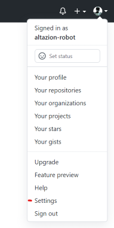
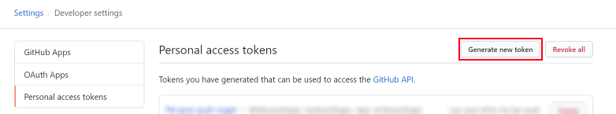
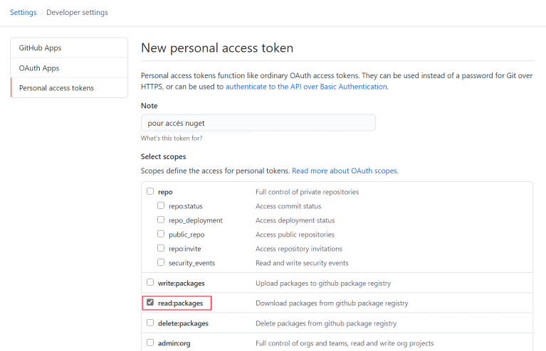
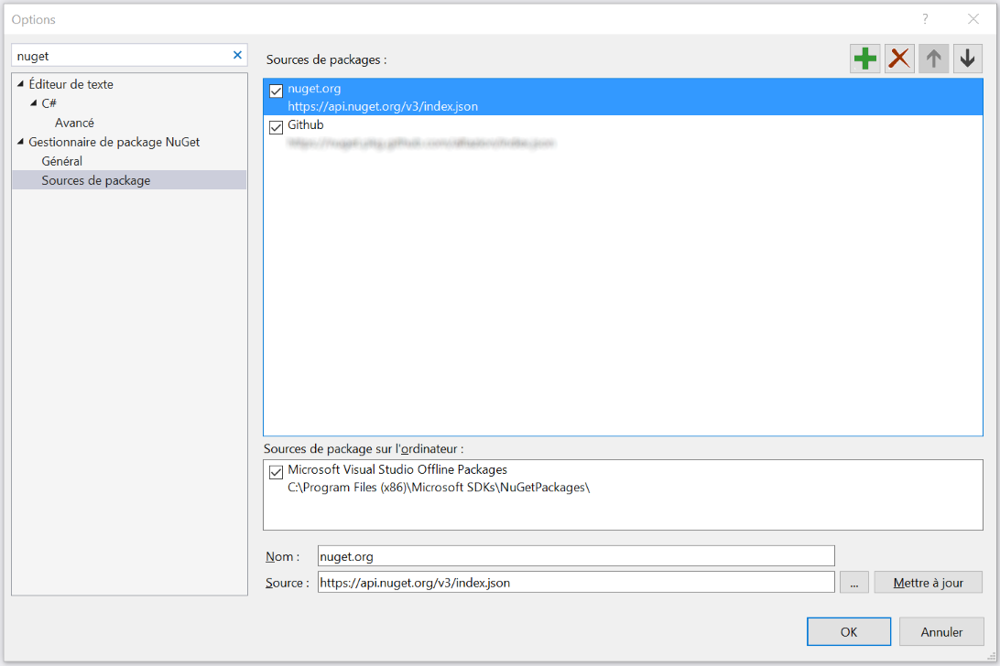
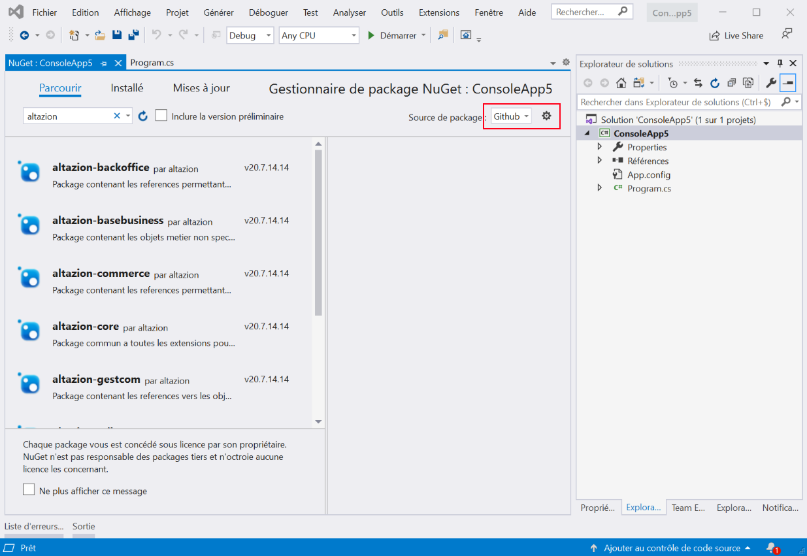

# Se connecter au SDK OnPremise

## Créer un compte Github

Si vous n'en avez pas encore, créez un compte Github.

## Demander l'accès

Pour l'instant, l'accès à notre SDK _OnPremise_ est uniquement possible après avoir été accepté dans notre programme Partenaires. Pour plus de renseignements merci de nous contacter via l'email présente sur notre profil Github [https://github.com/altazion](https://github.com/altazion).

## Créer un token PAT

- Accédez à vos options utilisateurs sur GitHub

- Allez dans les options développeurs puis dans Personnal Access Token 
- Créez un nouveau Token
 

 
- Donnez lui un nom puis cochez le choix read:packages

 
- Validez la création
- Notez le code qui vous est donné en retour : vous ne pourrez plus le retrouver facilement après avoir quitté cette page

## Ajoutez la source de package dans visual studio

- ouvrez visual studio
- ouvrez les options et cherchez le groupe "Sources de packages nugets"
- Ajoutez une ligne dans les sources avec les informations suivantes :
 -  Nom : Altazion
 -  Source : https://nuget.pkg.github.com/altazion/index.json

- Créez un projet simple (une application console .net framework 4.6.1+) et cliquez sur _Gérer les packages nuget_
- Modifiez la source dans l'angle en haut à gauche pour choisir celle que vous venez de créer

- Saisissez votre identifiant Github et le token PAT en tant que mot de passe

# Contenu des packages nugets

Le sdk est mis à disposition sous formes de packages nugets, et est consitué de plusieurs ensembles.

## Développement de module back-office 

A utiliser pour étendre Office, Orchestrator ou Automate.

_**Attention**, jusqu'à la version 2023.6 (prévue pour le 9 Juillet 2023), pour ces modules, nous vous invitons à utiliser les versions prélimimaires "-beta" si vous utilisez Kubernetes ou .net 5.0+ pour déployer nos outils OU la version "standard" si vous déployez via IIS, Azure Web App ou développez en .net framework 4.8. Veillez à ne pas mélanger les deux versions. A compter de la version 2023.6, la version "-beta" sera supprimée et vous pourrez basculer tous vos développements sur la branche principale._

_Les outils réalisés avec les branches "non beta" devront être développée en .net Framework 4.8, ceux développés avec les branches beta sont destinés à être utilisé dans .net core ou .net 5.0 et supérieur._

_A partir de la version 2023.6, la plateforme obligatoire pour les nouveaux développement est .net standard 2.0 pour les assemblies déployées en tant que modules d'extension_

### altazion-core
|Assembly|
|---|
|CPointSoftware.Equihira.Common|
|CPointSoftware.Equihira.Extensibility|

### altazion-basebusiness
|Assembly|
|---|
|CPointSoftware.Equihira.Business.Common|

### altazion-gestcom
|Assembly|
|---|
|CPointSoftware.Equihira.Business.GestCom|

### altazion-server
|Assembly|
|---|
|CPoint.Equihira.CPoint.Business|
|CPointSoftware.ECommerce.Business|
|CPointSoftware.Equihira.Business.Legal|
|CPointSoftware.Equihira.Business.Logistique|
|CPointSoftware.Equihira.Business.PointOfSale|
|CPointSoftware.Faneon.Business|

Utilisez ce package pour le développement de modules **Office** ou **Orchestrator**, ou pour la réalisation d'applications externes (extranets, outils de support, etc.)

### altazion-rails
|Assembly|
|---|
|CPointSoftware.Equihira.Rails|

Utilisez ce package si vous souhaitez compléter **Automate** ou déployer vos batchs personnalisés. Ce nuget contient toutes les définitions de nos batchs standards dont vous pouvez éventuellement dériver pour modifier leur comportement.

## Développement de module front-office 

A utiliser pour le développement de module s'intégrant dans Commerce, Signage, Store ou Seller.

### altazion-commerce

|Assembly|
|---|
|CPointSoftware.ECommerce.Tools|

Les modules développés en utilisant ce nuget peuvent être déployés dans Commerce, Signage, Store et Seller

## Développement Hub / Edge

Les deux packages :

- __altazion-hub-host__ 
- __altazion-hub__ 

doivent être utilisés conjoitement pour tous les dévelopements de modules pour Altazion Hub.