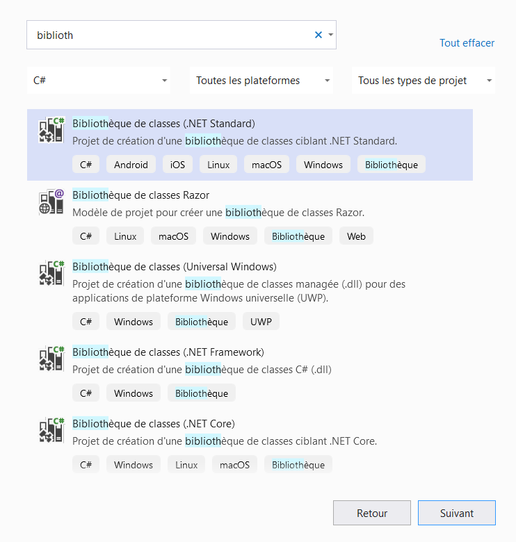

# Extensibilité Altazion Hub

## Développer un module

``` csharp
using Altazion.Hub.Common;
using System;
using System.Collections.Generic;
using System.Text;

namespace Altazion.Hub.Modules.Exemple
{
    public class ExempleModule : IAltazionHubModule
    {
        bool IAltazionHubModule.Execute()
        {
            return false;
        }

        void IAltazionHubModule.Init(IAltazionModuleHost host, string init)
        {
            
        }

        bool IAltazionHubModule.Poll()
        {
            return false;
        }

        public string ExecuteCommand(string command, string parameters)
        {
            return "OK";
        }
    }
}
```

### Créer le projet

Depuis la version 3.0, les modules Hub sont uniquement des composants développés en .net standard 2.0 et supérieur. Pour créer un nouveau module, créez tout simplement un projet assembly .net standard 2.0.

Dans Visual Studio, vous pouvez créer un projet de "Bibilothèque de classe .net standard 2.0".



Si vous utilisez un autre IDE, la commande 

```powershell
dotnet new classlib -f netstandard2.0
```

vous permettra de créer le projet.


### Réferencer les nugets

Vous devrez ensuite ajouter les nugets Altazion Hub à votre projet.

### Implémenter l'interface

### Ecrire le fichier manifeste

Vous devrez ensuite écrire un fichier manisfest en json pour déclarer votre module auprès du service de déploiement. Ce fichier est nécessaire à la fois pour un déploiement sur un service Windows, un daemon Linux ou pour un déploiement via Docker, bien que son rôle soit légèrement différent en fonction de l'environnement.

Si vous utilisez Visual Studio, vous pouvez ajouter le catalogue de schéma de nos solutions dans votre IDE afin de pouvoir profiter d'Intellisense. Pour cela, allez dans le menu **Outils**>**Options** puis dans **Editeur de texte** > **JSON** > **Schémas**, et ajoutez notre catalogue de schémas :


`https://schemas.altazion.com/schema-catalog.json`


### Packager et déployer

#### Pour Docker

=> se baser sur l'image [altazion/hub-host](https://hub.docker.com/repository/docker/altazion/hub-host)
=> copier le contenu de votre module dans /app/bin/ de cette image
=> créer votre docker file 

```text
FROM altazion/hub-host:latest AS base
WORKDIR /app
COPY "./" /app/bin/
ENTRYPOINT ["dotnet", "Altazion.Hub.Host.dll"]
```

#### Pour service Windows ou SystemD linux

## Ajouter un service API

### Implémenter l'interface supplémentaire

### Ajouter le(s) controleur(s)

Vous aurez ensuite simplement besoin d'ajouter vos controlleurs Web API :

- Ajoutez une référence au nuget `Microsoft.AspNetCore.Mvc.Core` afin d'importer tous les types nécessaires
- Puis créez une ou plusieurs classe(s) de type _controleur Web API_ :

```csharp
[Route("api/demo"), ApiController]
public class MonController : ControllerBase
{
    [Route("methode1"), HttpGet]
    public string Methode1()
    {
        return "OK";
    }
}
```

## Implémenter une fonctionnalité spécifique

|Zone|Fonctionnalité|
|---|---|
|CRM|[Base données clients](crm/ICustomersRepositoryExt.md)