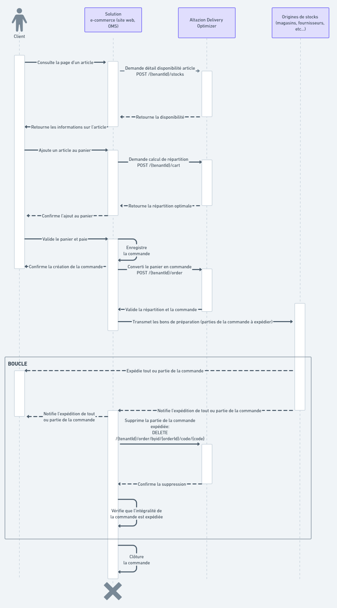

# Cas d’utilisation typique
Le diagramme de séquence ci-dessous présente un exemple d’intégration typique du module Delivery Optimizer (DO) dans un système d’information. Il résume toutes les interactions entre le DO et les autres acteurs lors de la création du panier en ligne, du passage de la commande à sa clôture.

À noter qu’il est possible de procéder différemment en fonction de l’architecture du SI cible. La transformation du panier en commande peut par exemple avoir lieu via les points API de gestion de commandes ou celui de calcul de la répartition.

De la même façon, les commandes peuvent être supprimées de plusieurs façon :
- Via l'utilisation des points API de Delivery Optimizer de suppression unitaire des commandes au fur et à mesure.
- Via le point API de synchronisation complète des commandes à déclencher à interval régulier.