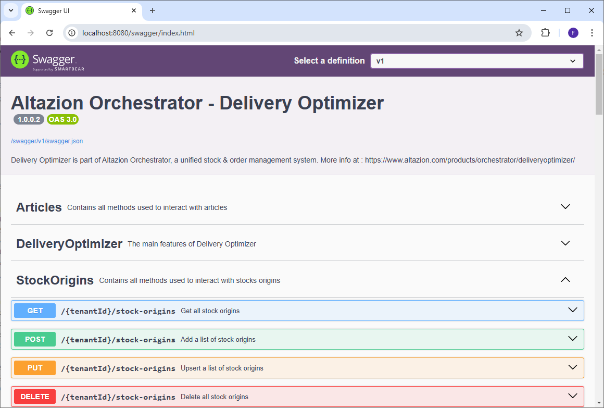

# Présentation du module

## Généralités
Le module Delivery Optimizer (DO) intervient dans le cadre du commerce unifié et permet aux origines de stocks (magasins, fournisseurs, stock propre, etc..) participantes d'expédier des articles aux clients finaux depuis leurs stocks. Ceci permet de disposer de stocks totaux plus importants ainsi que des possibilités d'expéditions plus intéressantes.

De cette façon, Delivery Optimizer permet par exemple d'expédier une partie d'une commande depuis un entrepôt et une autre depuis un ou plusieurs magasins. Le but étant de minimiser le nombre d'envois tout en répondant à d'autres critères tel que minimiser la distance entre les expéditeurs et le client.

Pour ce faire, le module permet entre autres de :
- Gérer les articles et leur stock
- Gérer les origines de stocks
- Gérer les commandes et paniers
- Obtenir le détail des disponibilités d'un article ainsi que la quantité maximum commandable
- Obtenir la répartition optimale d'un panier/d'une commande à affecter aux différentes origines de stocks

Le module se présente sous forme d’un serveur API à déployer dans votre solution et à appeler par les autres composants de votre système d'information (site e-commerce, système de gestion de commande, etc..).

Il a vocation à s'intégrer dans le reste de la solution Altazion de cette façon :

## Notion de d'origines de stocks (StockOrigins)

Les origines de stocks regroupe l'ensemble des entités pouvant participer à l'expédition de toute ou partie d'une commande. Les plus connues sont par exemple :
 - Un magasin
 - Un entrepot
 - Un fournisseur

Les origines de stocks sont identifiées par un code qui doit être unique. Altazion utilise la syntax suivante pour les codes :

"{codePays}:{typeDeStockOrigin}:{identifiantStockOrigin}"

Par exemple, pour un magasin belge ayant pour identifiant "0265", le code généré sera : "BEL:MAG:0265".
Le code d'un fournisseur français ayant pour identifiant "Evian" sera : "FRA:FRN:EVIAN" 

## Système de log et contrôle de la verbosité
Le module DO dispose d’un système complet de log utilisant Datadog, un service de surveillance d’infrastructure qui est hébergé dans le cloud.

Pour le configurer vous aurez besoin de fournir les variables d’environnements suivantes :
- DATADOG_SERVER, qui contient l’url vers votre serveur datadog
- DATADOG_KEY, qui est la clef d’accès à votre serveur
- DATADOG_TAGS (optionnel), qui contient les tags séparés par des virgules.

Le système de log du module DO possède deux niveaux de verbosité, normal et full. Le mode normal activé par défaut ne log que les informations relatives aux opérations d'écritures (ajout d'une commande, import d’Articles ou de StockOrigins, etc..). Le mode full log également les informations relatives aux actions de lecture (calcul des stocks, lecture en base, etc..) et est activé si la variable d'environnement DATADOG_FULL_VERBOSITY est présente et positionnée à "true".

Dans tous les cas, l’intégralité des logs est affichée dans la console du module.

## Base de données Mongo
Le module est prévu pour fonctionner avec une base de données Mongo en version 4.2 ou supérieur compatible avec les notions de replica sets et de sharded clusters.

La connexion à la base Mongo se fait grâce aux deux variables d’environnement suivantes :
- AZURE_APPCONFIG qui contient l’adresse du Azure App Configuration contenant la connection string de la base Mongo.
- AZURE_APPCONFIG_ENV qui contient l’environnement duquel récupérer la clef (DEV, PRODUCTION, etc…).

## Déploiement
Le module Altazion Delivery Optimizer est distribué sous forme d’un container Docker et peut ainsi être déployé facilement sur tous les environnements compatibles. Il expose le port 8080 par défaut. Pour vérifier son bon déploiement il est possible de se rendre sur l’URL du module qui devrait renvoyer la page suivante.

À partir de là, il est possible de cliquer sur les boutons de la section « Tools » afin de se rendre sur les pages correspondantes.

## Swagger
Le serveur API exporte un swagger respectant la norme OpenAPI 3.0.1 à l’adresse "/swagger/v1/swagger.json"

Il dispose également d'une interface web SwaggerUI permettant de facilement tester les points API disponibles ainsi que de consulter le détail des objets en entrée/sortie. Cette interface est disponible à l’adresse "/swagger". Enfin permet également de consulter le détail, les définitions et la structure de tous les objets que vous pourriez être amené à manipuler en utilisant le module.

## Metrics via OpenTelemetry et Prometheus
[OpenTelemetry](https://opentelemetry.io/) est un standard d'APIs, de SDK et d'outils permettant la collecte et l'export de données de télémétries. Ces données sont exportées via [Prometheus](https://prometheus.io/), un logiciel libre de surveillance informatique (monitoring) et sont accessibles à l'adresse "/metrics" du module.

Ces metrics sont observées afin d'obtenir des informations sur l'état et les performances de la base et du module et peuvent être lues par un logiciel d'affichage de metrics tel que [Grafana](https://grafana.com/).

Actuellement, le module remonte les statistiques suivantes :
- L'évolution du nombre de StockOrigins en base ("stock-origin.total")
- L'évolution du nombre d'Articles en base ("article.total")
- Le nombre total d'interrogations de calcul de disponibilité article ("stock.api_request_counter")
- Le nombre d'interrogations de calcul de disponibilité article avec un stock > 0 ("stock.available_counter")
- Le nombre d'interrogations de calcul de disponibilité article avec un stock <= 0 ("stock.unavailable_counter")
- Un histogramme sur le temps d'exécution du calcul de stock ("stock.api_request_duration")
- Le nombre total d'appel au point api de calcul de la répartition d'un panier ("cart.api_request_counter")
- Le nombre d’interrogations de calcul de la répartition d'un panier résultant à une répartition possible ("cart.distribution_found_counter")
- Le nombre d’interrogations de calcul de la répartition d'un panier sans répartition possible ("cart.distribution_not_found_counter")
- Un histogramme sur le temps d'exécution du calcul de répartition d'un panier ("cart.api_request_duration")
- Le nombre de paniers comportant du stock ignoré dans un StockOrigin car un autre panier l'a reservé.