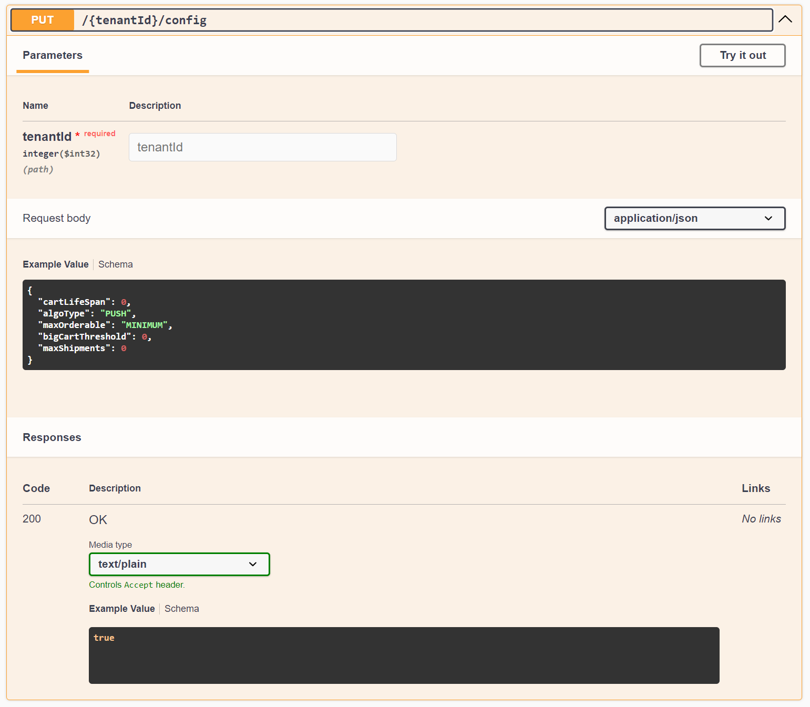
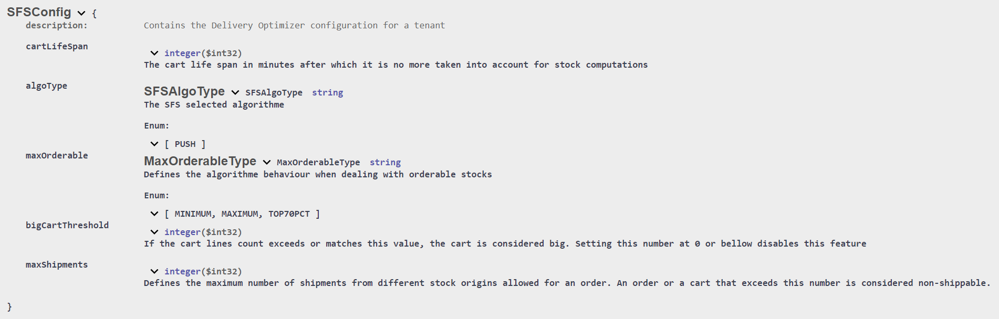

# Raisons juridiques et configuration du module 

## Support de multiples raisons juridiques
Le module Delivery Optimizer (DO) est prévu pour supporter plusieurs raisons juridiques, c'est à dire qu’elles peuvent coexister sans que l’une puisse accéder aux données d’une autre. Ceci peut être utile si vous souhaitez utiliser le module DO pour plusieurs marques ou zones géographiques par exemple.

Au sein du module il s’agit un nombre entier strictement supérieur à 0 nommé tenantId qu’il sera nécessaire de renseigner dans la route de chaque appel API afin d’indiquer au module quelle raison juridique est concernée par l’appel.

Les raisons juridiques sont sauvegardées en base et disposent de caractéristiques supplémentaires :
- Une configuration afin de pouvoir personnaliser l’utilisation du module DO.
- Des utilisateurs disposant de droits spécifiques

## Configuration du module
Chaque raison juridique dispose d’une configuration afin de pouvoir personnaliser son utilisation du module DO.

La configuration est ajoutée par Altazion au moment de la création des raisons juridiques. Si vous utilisez les outils OMS fournis par Altazion, l’édition de la configuration se fera depuis votre gestion commerciale dans les options des sources d’approvisionnement.

Autrement il est possible de modifier la configuration en appelant l'un des points API suivant :

__PUT : {tenantId}/sfs-config__

__PUT : {tenantId}/config__

Pour utiliser ce point, il est nécessaire de passer un objet de type SFSConfig dans le body de la requête. 

L'objet SFSConfig contient les champs suivants :

- __cartLifeSpan__ (défaut : 15). Détermine la durée de validité en minutes d'un panier. Lorsqu'elle est dépassée, les stocks réservés par le panier ne sont plus compatibilisés par Delivery Optimizer. Tous les paniers n'ayant pas été mis à jour depuis depuis 2 fois la valeur __cartLifeSpan__ sont progressivement supprimés.
- __algoType__ (défaut : "PUSH"). Détermine le type d'algorithme utilisé par Delivery Optimizer. À ce jour, seul l'algorithme PUSH existe.
- __maxOrderable__ (défaut : "MINIMUM). Détermine la méthode de calcul de la quantité maximum de stock commandable pour un produit.
- __bigCartThreshold__ (défaut : 15). Détermine à partir de combien de lignes panier l'algorithme de répartition doit utiliser les précédents calculs de répartition afin d'accélérer le traitement du panier/de la commande.
- __maxShipments__ (défaut : illimité). Détermine le nombre maximum d'expéditions différentes pour une commande/un panier. Autrement dit, il s'agit du nombre maximum d'origines de stock différentes qui peuvent être solicitées pour le traitement d'une commande/un panier. Concrétement, il s'agit de la taille maximum du tableau __SFSResponse.splits__. Si ce nombre est dépassé, toutes les lignes du panier sont concidérées comme étant non expédiables et sont donc renvoyées dans le champ __SFSResponse.nonShippable__.

Comme pour tous les autres points API, vous pouvez retrouver la définition de l'objet en anglais dans le swagger du module :

