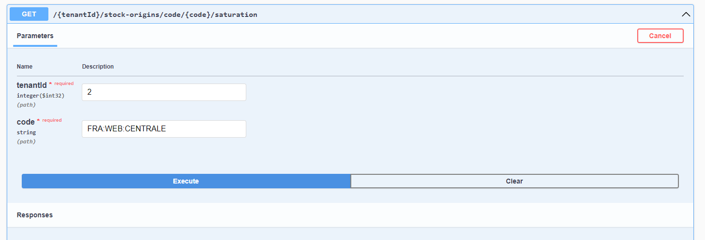
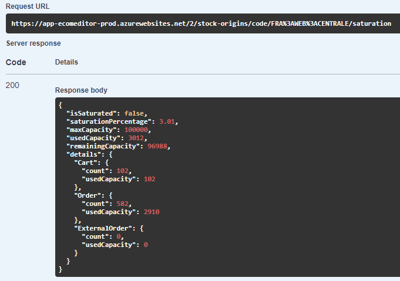

# Règles métier Delivery Optimizer

## Notion de priorité
Certaines origines de stocks sont plus indiquées que d'autres pour expédier des commandes. C'est notamment le cas d'entrepôts spécialisés ou de grands magasins. Il est ainsi possible de définir un indice de priorité pour chaque emplacement afin d'encourager les expéditions depuis ces derniers.

Dans le cas où vous utilisez les outils Altazion cette option est configurable depuis votre gestion commerciale.
## Notion de saturation

### Définition ###
Lorsqu'un StockOrigin dispose déjà de beaucoup de commandes à traiter il peut être saturé. Chaque StockOrigin dispose d'une capacité de traitement (StockOrigin.MaxCapacity) qui lorsqu'elle est dépassée ne permet plus à l'origine de stocks d'accepter de nouvelles commandes (OrderType.Cart, OrderType.Order) et entraine son exclusion de l'algorithme de répartition.

Les commandes et les paniers augmentent la saturation des StockOrigins de respectivement 5 et 1 point. Le nombre de PointsMax peut-être décidé en fonction de la nature du StockOrigin (magasin, fournisseur, entrepôt, etc..), ou encore sur d'autres critères telle que la taille ou la capacité logistique de traitement des commandes par exemple.

Dans le cas où vous utiliser les outils Altazion cette option est configurable depuis votre gestion commerciale.

La durée durant laquelle les OrderType.Cart (paniers en cours) sont comptabilisés pour le calcul de la saturation est paramétrable via le champ CartLifeSpan de l'objet SFSConfig du tenant associé.

Les commande de type OrderType.ExternalOrder n'affectent pas la saturation.

Lorsque qu'une commande est traitée celle-ci est supprimée du StockOrigin et libère ainsi des capacités de traitement.

### Point API de vérification de saturation ###
Il est possible de vérifier la saturation d'un StockOrigin via le point API suivant :

__POST : {tenantId}/stock_origins/code/{code}/saturation__

Ce dernier peut être utile si vous remarquez qu'un StockOrigin ne peux plus prendre de commandes ou pour obtenir des informations générales sur l'état de son activité.

Le point est disponible dans la partie StockOrigins du swagger :

Si le StockOrigin n'existe pas le point API renvoie une erreur 404. Autrement un objet de type StockOriginSaturationInfo est renvoyé (le schéma complet de l'objet est disponible dans le swagger).

Voici un exemple avec le StockOrigin FRA:WEB:CENTRALE :

À la lecture des données de réponse, on constate que le StockOrigin n'est pas saturé et que sa saturation est de 3.01%. Sa capacité maximum est de 100 000 points parmis lesquels 3012 points de capacité sont utilisés par 102 paniers (102 points car un panier vaut 1 point) et 582 commandes (2910 points car une commande vaut 5 points). Sa capacité restante est de 96988 points (100 000 - 3012).