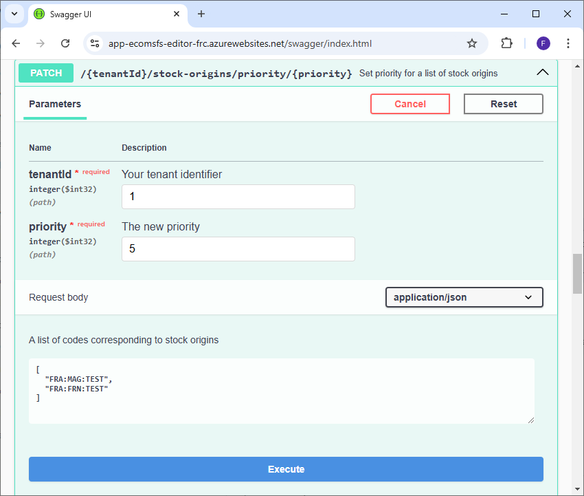
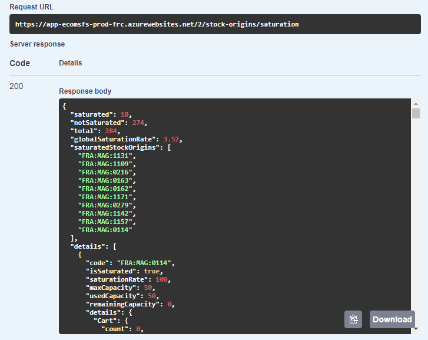

# Règles métier Delivery Optimizer

## Activité des origines de stocks

### Définition

Chaque origine de stock peut être activé ou désactivé afin qu'elle participe ou non à l'expédition des commandes et au calcul de stock disponible à la vente grâce au champ __StockOrigin.IsActive__.

### Activation/Désactivation des origines de stocks

Dans le cas où vous utilisez les outils Altazion cette option est configurable depuis votre gestion commerciale.

Il est également possible d'activer/désactiver une ou plusieurs origines de stocks directement dans Delivery Optimizer via le point API suivant :

__PATCH {tenantId}/stock-origins/isactive/{isActive}__

Le point est disponible dans la partie StockOrigins du swagger :

Pour utiliser cette fonctionnalité, il est nécessaire de fournir un tableau formaté en JSON dans le body contenant les codes des origines de stock à modifier. Vous devrez aussi renseigner le booléen "isActive" indiquant d'activer les origines de stocks s'il est à "True", ou de les désactiver s'il est à "False".

## Notion de priorité

### Définition
Certaines origines de stocks sont plus indiquées que d'autres pour expédier des commandes. C'est notamment le cas d'entrepôts spécialisés ou de grands magasins. Il est ainsi possible de définir un indice de priorité pour chaque emplacement afin d'encourager les expéditions depuis ces derniers.

__Plus la priorité d'une origine de stocks est élevé, plus elle a de chance d'être sélectionnée pour expédier toute ou partie d'une commande.__

### Modification de la priorité des origines de stocks

Dans le cas où vous utilisez les outils Altazion cette option est configurable depuis votre gestion commerciale.

Il est également possible de modifier la priorité d'une ou plusieurs origines de stocks directement dans Delivery Optimizer via le point API suivant :

__PATCH {tenantId}/stock-origins/priority/{priority}__

Le point est disponible dans la partie StockOrigins du swagger :

Pour utiliser cette fonctionnalité, il est nécessaire de fournir un tableau formaté en JSON dans le body contenant les codes des origines de stock à modifier. Vous devrez aussi renseigner le paramètre "priority" indiquant la nouvelle priorité de ces origines de stocks.

## Notion de saturation ##

### Définition ###
Lorsqu'un StockOrigin dispose déjà de beaucoup de commandes à traiter il peut être saturé. Chaque StockOrigin dispose d'une capacité maximum de traitement (__StockOrigin.MaxCapacity__) qui lorsqu'elle est dépassée ne permet plus à l'origine de stocks d'accepter de nouvelles commandes (OrderType.Cart, OrderType.Order) et entraine son exclusion de l'algorithme de répartition.

Les commandes et les paniers augmentent la saturation des StockOrigins de respectivement 5 et 1 point. Le nombre __MaxCapacity__ peut-être décidé en fonction de la nature du StockOrigin (magasin, fournisseur, entrepôt, etc..), ou encore sur d'autres critères telle que la taille ou la capacité logistique de traitement des commandes par exemple.

La durée durant laquelle les __OrderType.Cart__ (paniers en cours) sont comptabilisés pour le calcul de la saturation est paramétrable via le champ __CartLifeSpan__ de l'objet __ConfigDo__ du tenant associé.

Les commande de type __OrderType.ExternalOrder__ n'affectent pas la saturation.

Lorsque qu'une commande est traitée celle-ci est supprimée du StockOrigin et libère ainsi des capacités de traitement.

### Modification de la capacité maximum des origines de stocks

Dans le cas où vous utilisez les outils Altazion cette option est configurable depuis votre gestion commerciale.

Il est également possible de modifier la capacité maximum d'une ou plusieurs origines de stocks directement dans Delivery Optimizer via le point API suivant :

__PATCH {tenantId}/stock-origins/maxcapacity/{maxcapacity}__

Le point est disponible dans la partie StockOrigins du swagger :

Pour utiliser cette fonctionnalité, il est nécessaire de fournir un tableau formaté en JSON dans le body contenant les codes des origines de stock à modifier. Vous devrez aussi renseigner le paramètre "maxcapacity" indiquant la nouvelle capacité maximum de ces origines de stocks.

### Points API de vérification de saturation ###

Ces points API sont utiles si vous remarquez qu'un ou plusieurs StockOrigins ne peuvent plus prendre de commandes ou pour obtenir des informations générales sur l'état de leurs activités.

#### Vérification de la saturation d'un StockOrigin ####
Il est possible de vérifier la saturation d'un StockOrigin via le point API suivant :

__GET : {tenantId}/stock-origins/code/{code}/saturation__

Le point est disponible dans la partie StockOrigins du swagger :

Si le StockOrigin n'existe pas le point API renvoie une erreur 404. Autrement un objet de type __StockOriginSaturationInfo__ est renvoyé (le schéma complet de l'objet est disponible dans le swagger).

Voici un exemple avec le StockOrigin FRA:WEB:CENTRALE :

L'objet __StockOriginSaturationInfo__ obtenu en réponse contient des données statistiques facilement interprétables. Par exemple, à la lecture des données de réponse, on constate ici que le StockOrigin n'est pas saturé et que sa saturation est de 3.01%. Sa capacité maximum est de 100 000 points parmis lesquels 3012 points de capacité sont utilisés par 102 paniers (102 points car un panier vaut 1 point) et 582 commandes (2910 points car une commande vaut 5 points). Sa capacité restante est de 96988 points (100 000 - 3012).

#### Vérification de la saturation de tous les StockOrigins ####

Delivery Optimizer dispose d'un point API permettant d'obtenir un diagnostic complet de la saturation de l'ensemble de vos StockOrigins. Ce point est par exemple très utile lors de périodes de fortes activités. Il peut vous permettre d'anticiper l'éventuel saturation globale de vos StockOrigins et d'ainsi éviter la paralysie de votre activité.

__GET : {tenantId}/stock-origins/saturation__

Le point est disponible dans la partie StockOrigins du swagger :

Un objet de type __StockOriginsGeneralSaturation__ est obtenu en réponse de cet appel :

Il contient les champs suivants :
- __saturated__ : Le nombre de StockOrigins saturés.
- __notSaturated__ : Le nombre de StocksOrigins non saturés.
- __total__ : Le nombre total de StocksOrigins.
- __globalSaturationRate__ : Le pourcentage de StockOrigins saturés.
- __saturatedStockOrigins__ : Une liste contenant le code des StocksOrigins saturés.
- __details__ : Un tableau de __StockOriginSaturationInfo__ contenant l'état de saturation de tous les StockOrigins en commençant par les StockOrigins saturés.