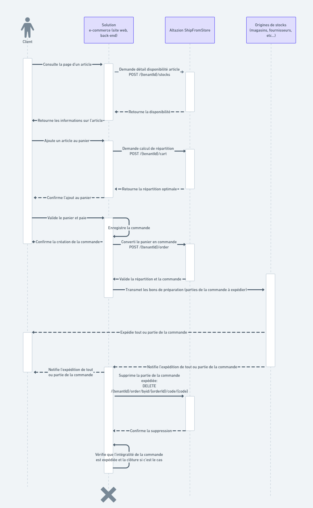

# Cas d’utilisation typique
Le diagramme de séquence ci-dessous présente un exemple d’intégration typique du module SFS dans un système d’information. Il résume toutes les interactions entre le module SFS et les autres acteurs lors de la création du panier en ligne, du passage de la commande et sa clôture.

À noter qu’il est possible de procéder différemment en fonction de l’architecture du SI cible. La transformation du panier en commande peut par exemple avoir lieu via les points API de gestion de commandes ou celui de calcul de la répartition.

De la même façon, si les données d’Articles et de StockOrigins sont régulièrement synchronisée via un import complet, il est possible de ne pas supprimer les commandes dans le module une fois qu’elles sont traitées. En effet, dans la mesure où les Articles et StockOrigins doivent uniquement contenir les commandes en cours, les commandes déjà traitées seront ainsi supprimées durant l’import.