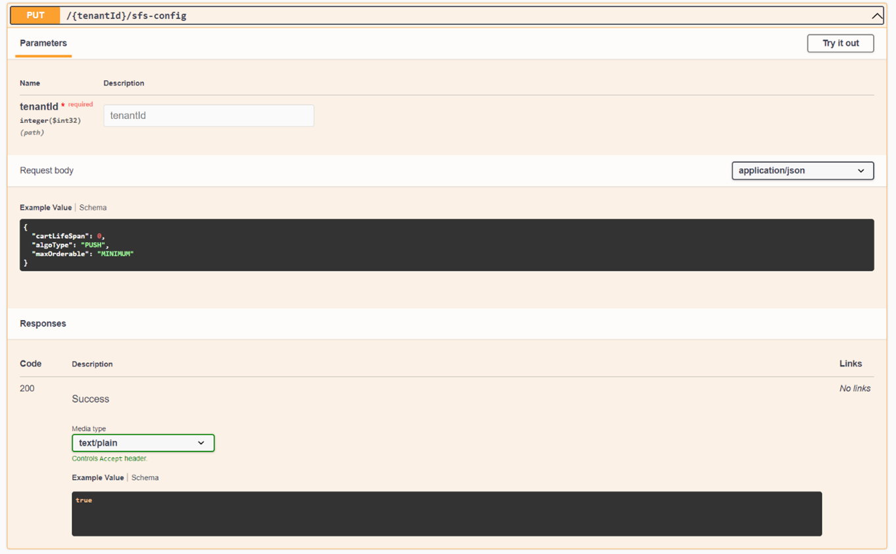
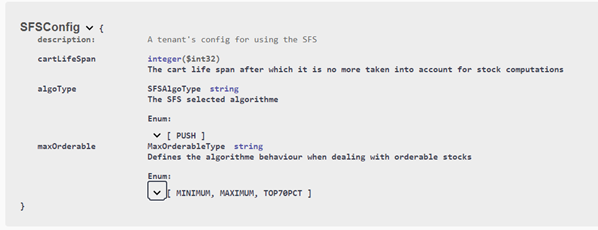

# Raisons juridiques et configuration du module 

## Support de multiples raisons juridiques
Le module Delivery Optimizer (DO) est prévu pour supporter plusieurs raisons juridiques, c'est à dire qu’elles peuvent coexister sans que l’une puisse accéder aux données d’une autre. Ceci peut être utile si vous souhaitez utiliser le module DO pour plusieurs marques/zones géographique.

Au sein du module il s’agit un nombre entier strictement supérieur à 0 nommé tenantId qu’il sera nécessaire de renseigner dans la route de chaque appel API afin d’indiquer au module quelle raison juridique est concernée par l’appel.

Les raisons juridiques sont sauvegardées en base et disposent de caractéristiques supplémentaires :
- Une configuration afin de pouvoir personnaliser l’utilisation du module DO.
- Des utilisateurs disposant de droits spécifiques

## Configuration du module
Chaque raison juridique dispose d’une configuration afin de pouvoir personnaliser son utilisation du module DO.

La configuration est ajoutée par Altazion au moment de la création des raisons juridiques. Si vous utilisez les outils OMS fournis par Altazion, l’édition de la configuration se fera depuis votre gestion commerciale dans les options des sources d’approvisionnement.

Autrement il est possible de modifier la configuration en appelant le point API suivant :

__PUT : {tenantId}/sfs-config__

Pour utiliser ce point il est nécessaire de passer un objet de type SFSConfig dans le body de la requête. Comme tous les autres points API, il est détaillé dans le swagger du module.

