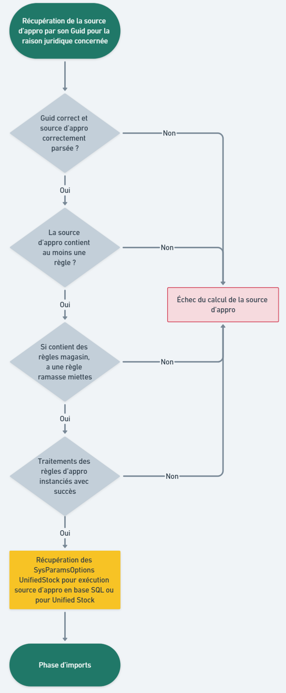
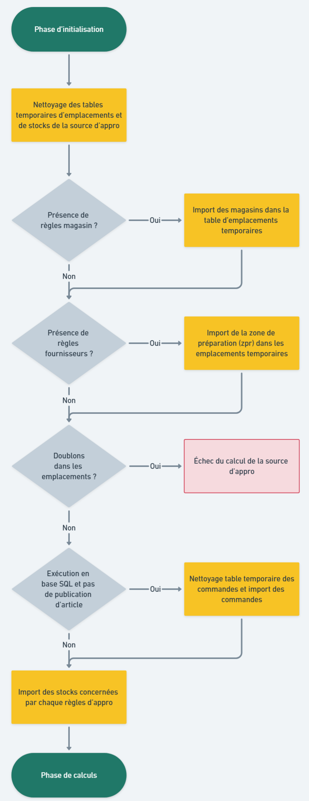
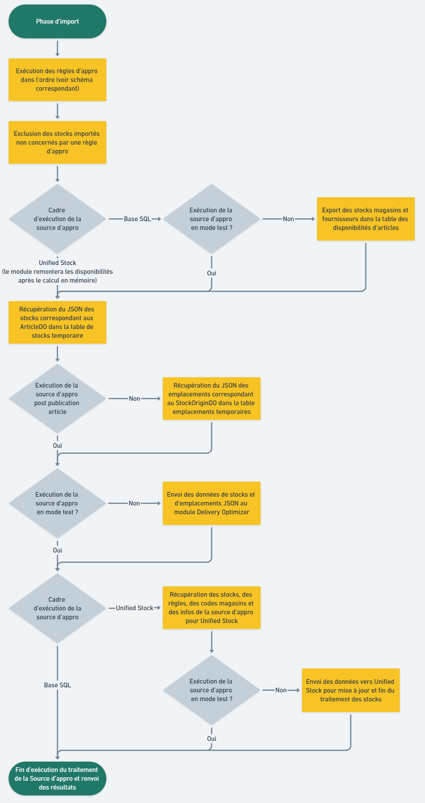

# Exécution d'une Source d'Approvisionnement

## Généralités

### Déclenchement du calcul d'une source d'approvisionnement

Le calcul d'une source d'approvisionnement peut être déclenché de plusieurs façons :
- En réponse à un évènement (après un import de stocks, la modification d'articles, la modification des sources/règles/traitements d'approvisionnement, etc.)
- À heure fixe (tous les jours à 6h du matin par exemple)
- À intervalle régulier (toutes les heures)
- Manuellement

N'hésitez pas à vous rapprocher d'Altazion afin de déterminer ensemble de la meilleure stratégie à adopter pour le déclenchement des sources d'approvisionnement.

### Durée d'exécution du calcul

La durée du calcul dépend grandement des facteurs suivants :
- La taille de votre catalogue d'articles.
- Le nombre d'origines de stocks.
- La quantité et la complexité de vos règles.
- Si la source d'approvisionnement est exécutée en base de données ou pour Unified Stock (Unified Stock est généralement plus rapide et impact beaucoup moins la base de données principale).

Ainsi le temps d'exécution peut varier entre quelques secondes et plusieurs minutes. Bien que l'exécution des sources d'appro soit conçue pour limiter un maximum son impact sur le reste de votre système d'information, Altazion recommande d'exécuter les calculs complexes à des heures où le trafic sur votre base est faible (la nuit le plus souvent).

## Processus de calcul d'une source d'approvisionnement

L'exécution d'une source d'approvisionnement se divise en trois étapes principales.

### Initialisation de la source d'approvisionnement
Cette étape vérifie la configuration de la source d'approvisionnement, des règles et de leurs traitements.

### Import des données nécessaires au calcul
Cette phase récupère et prépare les origines de stocks ainsi que leurs stocks pour le calcul des règles.

### Calcul des disponibilités, enregistrement/export des résultats.
Cette dernière étape exécute les traitements et critères de disponibilités des règles de la source. Une fois tous les calculs terminés, les résultats sont enregistrés et exportés vers Delivery Optimizer et Unified Stock (si les modules sont actifs).

