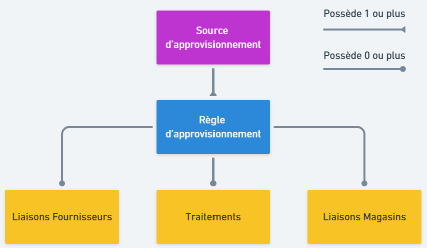

# Présentation

## Généralités

### Définition

Les sources d'approvisionnement servent à définir les stocks alloués à vos différents canaux de vente qui seront utilisés pour préparer les commandes passées sur ces canaux.
Il s'agit d'un module optionnel qui, une fois activé, remplace le calcul simple par un système plus complet permettant de choisir précisément les stocks à utiliser.

L'activation des sources d'approvisionnement est indispensable pour pouvoir utiliser les modules Delivery Optimizer et Unified Stock.

### Caractéristiques

Une source d'approvisionnement est associée à une raison juridique. Elle possède les caractéristiques suivantes :
- Un libelle (exemple : Site E-commerce France)
- Une icône à choisir pour l'affichage dans la gestion commerciale
- Des règles d'approvisionnement (voir ci-dessous)
- La possibilité ou non d'être archivé (une source d'approvisionnement archivé n'est pas exécutable)

Si vous souhaite lier la source d'approvisionnement à un module Delivery Optimizer, vous devrez également renseigner :
- L'url du module
- Les identifiants OMS du module
- Les identifiants E-Commerce du module
- La configuration du module
Pour plus d'information sur cette partie, veuillez consulter la documentation sur Delivery Optimizer.

### Composition d'une source d'approvisionnement

Comme évoqué ci-dessus, une source d'appro permet de définir des règles pour savoir quels stocks et quelle part de ces stocks est prise en compte pour chaque article. Ces règles d'approvisionnement sont entièrement paramétrables et vous permettent de gérer finement l'allocation de vos stocks à vos sources d'approvisionnement.

Pour ce faire, les règles peuvent s'appuyer sur des liaisons fournisseurs et magasins ainsi que des traitements. Pour plus d'informations sur les règles d'approvisionnement, consultez la page de documentation qui leur est dédiée.

Le schéma ci-dessous synthétise les relations entre les différentes entités qui composent une source d'approvisionnement :

## Association aux canaux de ventes

Afin de déterminer les quantités disponibles pour un canal de vente (site e-commerce, bornes, etc..), celui-ci doit être associé à une source d'approvisionnement. Lorsque cela est fait, le canal déporte tous calculs des stocks à un potentiel module Unified Stock et les calculs de paniers/commandes à un module Delivery Optimizer.

## Type d'exécution

Les sources d'approvisionnement peuvent être exécutées dans deux cadres différents :
 - Dans la base de données principale. Cette première version des sources d'approvisionnement considère la base comme référentiel des stocks. Cette version ne permet pas de disposer de vos stocks en temps réel.
 - Pour Unified Stock. Cette seconde version est utilisée si vous disposez d'un module Unified Stock paramétré. Dans ce cas, Unified Stock est considéré comme référentiel des stocks et permet de bénéficier du calcul de vos stocks en temps réel.

 En fonction du cadre d'exécution, le fonctionnement des sources d'approvisionnement diffère légèrement.