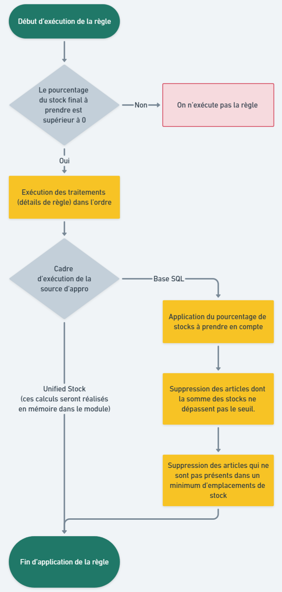

# Règles d'approvisionnement

## Généralités

### Définition

Une source d'appro permet de définir des règles pour savoir quel(s) stock(s) sont pris en compte pour chaque article.

Chaque règle concerne un des types de stocks suivant :
- Un stock “propre” géré
- Un stock “fournisseur” pour du drop shipping
- Un stock “magasin” pour du retrait OU pour du Ship From Store
- Un stock “partenaire” pour, par exemple, un vendeur marketplace

Une source d'approvisionnement doit au moins contenir une règle d'approvisionnement pour être valide.

### Sélection des stocks

Les règles d'appro disposent de paramètres servant à la sélection des stocks concernés par la règle :

- Le Rang, permet d'indiquer l'ordre croissant d'exécution des règles. L'ordre d'exécution des règles est important car un stock ne peut être affecté que par une seule règle. Si deux règles affectent le même stock, seule la première exécutée sera prise en compte.
- La code pays, pour sélectionner toutes les origines de stock d'un pays en particulier, peut être null si l'on souhaite cibler les origines de tous les pays disponibles.
- Le booléen indiquant si les commandes sont réservées par défaut.

### Calcul des disponibilités

Chaque règle peut également disposer de traitements spécifiques à exécuter avant d'effectuer les calculs ci-dessous. Consultez la page dédiée aux traitements pour plus d'information.

Enfin, les règles sont pourvues de paramètres ajustables pour le calcul des disponibilités finales :
- Le Pourcentage Dispo permet d'indiquer le pourcentage du stock total d'un article à rendre disponible (s'il est à 0, le calcul de la règle est ignoré). Obligatoire
- Le Seuil Quantité Dispo qui représente le seuil de quantité minimum à respecter pour le rendre les stocks d'un article disponible. La somme des stocks par articles doit être supérieur ou égale au seuil. Optionnel
- Le Nombre Minimum d'Eléments, il s'agit du nombre minimum d'emplacement de stocks qui doit rester après exécution de tous les détails de règles. En dessous de ce nombre, l'article complet est ignoré. Optionnel

## Exécution des règles d'approvisionnement

Les règles sont traitées en deux temps durant l'exécution des sources d'approvisionnement. On commence par importer les stocks liés à chaque règle en respectant l'ordre des rangs (voir phase d'import des données dans le traitement de la source d'appro).

Une fois cela terminé on réitère sur chaque règle afin d'exécuter les traitements spécifiques (voir page dédiée) et finalement procéder ou non à l'exécution du calcul des disponibilités.
Le diagramme de flux ci-dessous détaille les étapes d'exécution d'une règle d'approvisionnement après la phase d'import des stocks :

## Spécificités des règles "Magasins"

### Critères de sélection des magasins

Les règles magasins disposent de plusieurs critères qui leur sont spécifiques et qui servent à sélectionner et stocks et les magasins concernées par la règle :
- L'identifiant de Zone Magasin permettant de sélectionner les magasins d'une zone en particulier, peut être null si on souhaite cibler toutes les zones magasins.
- Le Type de Magasin, permettant de sélectionner les magasin affilié et franchisé ou les magasins intégré, peut être null si l'on souhaite cibler tous les types de magasins.

À noter que ces critères peuvent se combiner, permettant par exemple à l'utilisateur de sélectionner les magasins intégrés dans une zone spécifique en France. Il est également possible de ne sélectionner aucun critère pour cibler tous les magasins du client.

### Sélection/exclusion des magasins via les liaisons de la règle d'approvisionnement

Chaque règle magasin peut disposer d'une liste de magasins liés permettant, en fonction du type de liaison, d'inclure ou d'exclure uniquement les magasins de cette liste du calcul de la règle d'approvisionnement. Autrement dit, vous pouvez choisir d'inclure uniquement les magasins liés à la règle ou de sélectionner tous les magasins sauf ceux liés à la règle.

Cette liste est optionnelle et ne se cumule pas avec les autres critères de sélections décrits plus haut.

### Règle "ramasse-miettes"
Dans tous les cas il est nécessaire que la dernière règle magasin cible tous les magasins afin de faire office de "ramasse-miettes" et de traiter les magasins non inclus dans les précédentes règles. Si vous ne souhaitez pas traiter le stock des magasins restant, il suffit de passer le pourcentage de disponibilité à 0 pour cette règle et elle sera ignorée.

## Spécificités des règles "Fournisseurs"

### Critères de sélection des fournisseurs
Tout comme les règles magasins, les règles fournisseurs disposent de champs spécifiques servant à limiter les stocks concernés par la règle :

- Top Fournisseurs, il représente les X premiers fournisseurs de chaque stock à prendre en compte pour le calcul des stocks. Ces derniers sont classés par leur priorité. Peut être null si l'on souhaite sélectionner tous les fournisseurs.

### Sélection/exclusion des fournisseurs via les liaisons de la règle d'approvisionnement

Chaque règle fournisseur peut disposer d'une liste de fournisseurs liés permettant, en fonction du type de liaison, d'inclure ou d'exclure uniquement les fournisseurs de cette liste du calcul de la règle d'approvisionnement. Autrement dit, vous pouvez choisir d'inclure uniquement les fournisseurs liés à la règle ou de sélectionner tous les fournisseurs sauf ceux liés à la règle.

Cette liste est optionnelle et ne se cumule pas avec les autres critères de sélections décrits plus haut.

## Spécificités des règles "Sur Stocks"

### Critères de sélection des stocks
Les règles sur stocks disposent également de champs spécifiques servant à limiter les stocks concernés par la règle :

- L'id du dépôt concerné. Il sert à limiter les calculs à un dépôt en particulier. S'il est null alors tous les dépôts sont concernés.