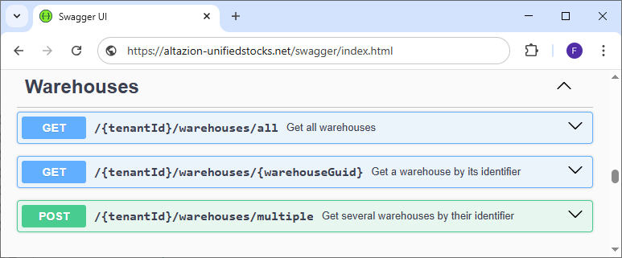

# Entrepôts et zones de stockage

## Généralités

Unified Stock regroupe les différents endroits contenant du stock (magasins, dépôts, etc.) sous une notion commune nommée "Entrepôts" (__Warehouses__ en anglais). Ces entrepôts peuvent posséder une ou plusieurs zones de stockage (__Storage Zones__).

De cette façon, un magasin est considéré par Unified Stock comme un entrepôt et sa surface de vente comme une première zone de stockage. Il peut, par exemple, également disposer d'une remise qui sera sa seconde zone de stockage.

Un dépôt sera également considéré comme un entrepôt et ses différents emplacements comme des zones de stockage. On peut par exemple avoir une zone réservée à la préparation de commandes (picking), une seconde pour le service après-vente ou encore une autre réservée au stockage à plus long terme.

## Modèle d'objet et règles métier

Chaque entrepôt (__Warehouse__) dispose d'un identifiant de type Guid (noté __id__) et d'un code court unique (noté __code__). Deux entrepôts ne peuvent pas avoir le même identifiant ou le même code.

D'autres informations viennent compléter les entrepôts :

- __name__ : Nom courant de l'entrepôt.
- __type__ : Définit le type d'entrepôt, peut être __MAG__ pour un magasin, __DPT__ pour un dépôt.
- __ownership__ : Permet de définir à qui appartient l'entrepôt. __Internal__ lorsqu'il appartient à l'entreprise, __External__ lorsqu'il est fourni par un prestataire externe.
- __address__ : L'adresse physique complète de l'entrepôt, à titre indicatif.
- __maxCapacity__ : La capacité maximale de stockage de l'entrepôt. Si elle est à 0, on considère que l'entrepôt n'a pas de limite de stockage.
- __isDeleted__ : Si "true", alors l'entrepôt a récemment été supprimé
- __storageZones__ : Un tableau contenant les zones de stockage. Pour être valide, un entrepôt doit posséder au moins une zone de stockage mais peut en posséder davantage (relation 1..n).

Le champ __storageZones__ dans les entrepôts contient des objets de type __StorageZone__.  Comme pour les __Warehouse__, chaque zone de stockage possède également un identifiant de type Guid (noté __id__) et un code court (noté __code__). Deux zones de stockage du même type ne peuvent pas avoir le même identifiant ou le même code.

D'autres informations viennent compléter les zones de stockage :

- __name__ : Nom courant de la zone de stockage.
- __purpose__ : Fonction de la zone de stockage. __Picking__ pour du stockage de courte durée (préparation), __Storage__ pour du stockage longue durée, __Defective__ pour le stockage des objets défectueux et/ou cassés, __AfterSalesService__ concerne le stockage pour le service après vente et __Assembly__ pour le stockage des produits destinés à la fabrication
- __storageType__ : Type de produits que la zone est habillitée à stocker. __None__ pour aucune condition de storage particulière, __Dry__ pour le stockage au sec, __Cold__ pour le stockage au froid, __Frozen__ pour la congélation.
- __hazmatIsoClasses__ : Tableau des habilitations de la zone à stocker certaines classes ISO de matières dangereuses (hazardous material - hazmat). Peut être vide si la zone n'a pas d'habilitation.
- __securityLevelIds__ : Habilitations de niveaux de sécurité. Peut être vide si la zone n'a pas d'habilitation de sécurité.
- __isDeleted__ : Si "true", alors la zone a récemment été supprimée.

Ci-dessous se trouve un exemple d'objet __Warehouse__ de type magasin contenant un tableau de deux __StorageZone__ en format JSON :

```json
{
    "ownership": "Internal",
    "address": "51 rue de l'Exemple, 86235, ExempleVille FRANCE",
    "maxCapacity": 2000,
    "isDeleted": false,
    "storageZones": [
        {
            "id": "956ea623-4788-40e4-b2b7-5c1654c951d8",
            "code": "0001SV",
            "name": "Dispo",
            "purpose": "Picking",
            "storageType": "None",
            "hazmatIsoClasses": [],
            "securityLevelIds": [],
            "isDeleted": false
        },
        {
            "id": "48c9e2e7-5d2b-4bde-92a7-eb990396342a",
            "code": "0001SAV",
            "name": "Zone SAV",
            "purpose": "AfterSalesService",
            "storageType": "None",
            "hazmatIsoClasses": [],
            "securityLevelIds": [],
            "isDeleted": false
        }
    ],
    "id": "956ea623-4788-40e4-b2b7-5c1654c951d8",
    "code": "0001",
    "name": "Magasin Exemple",
    "type": "MAG"
}
```

### Particularités des entrepôts de type Magasin

- Un magasin possède par défaut une zone de stockage correspondant à sa surface de vente.
- L'identifiant unique de cette zone est par défaut identique à l'identifiant de l'entrepôt (du magasin).
- Le code de cette zone est par défaut égal au code de l'entrepôt (du magasin) auquel on a ajouté le suffixe "SV" pour "Surface de Vente". Ainsi si le code du magasin est "0001" alors le code de la zone de stockage correspondant à sa surface de vente sera "0001SV".

## Gestion des entrepôts dans Unified Stock

### Synchronisation des entrepôts en base SQL avec Unified Stock

Un traitement entièrement géré par Altazion synchronise automatiquement les différents entrepôts paramétrés dans la base principale (magasins, dépôts, etc.) avec Unified Stock.

### Récupération des entrepôts depuis Unified Stock

Le module de traitement des stocks de Unified Stock permet de récupérer les entrepôts via des points API. Tous les points API sont détaillés dans l'interface SwaggerUI :



Ces points sont accessibles via l'URL de base suivante :

{UrlDeUnifiedStock}/{votreRaisonJuridique}/warehouses

Cette URL est à compléter en fonction de vos besoins :

- __/all__ en __GET__: permet d'obtenir tous les entrepôts disponibles dans Unified Stock. Retourne un tableau de __Warehouse__ en format JSON.
- __/{warehouseGuid}__ en __GET__ : permet de récupérer un entrepôt en remplaçant {warehouseGuid} par l'identifiant de l'entrepôts en question. Retourne un objet __Warehouse__ en format JSON.
- __multiple__ en __POST__ : permet d'obtenir plusieurs entrepôts en fournissant un tableau au format JSON contenant les identifiants des entrepôts à récupérer. Retourne un tableau de __Warehouse__ en format JSON.

Ainsi une url complète pour un client ayant accès au site "altazion-unifiedstocks.net", dont la raison juridique est "1" et qui souhaite obtenir tous les entrepôts sera :

https://altazion-unifiedstocks.net/1/warehouses/all