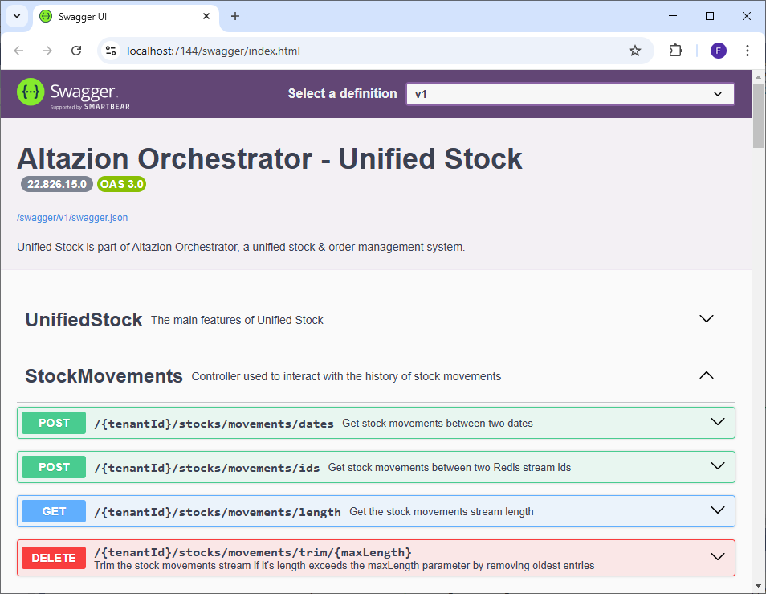
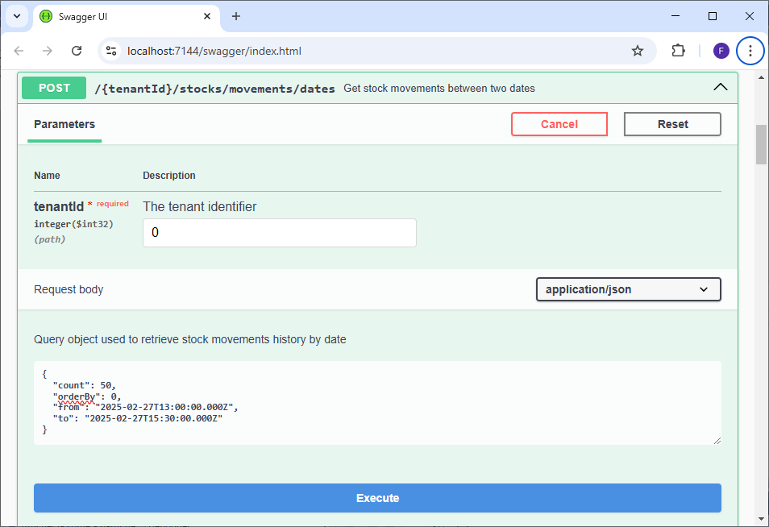
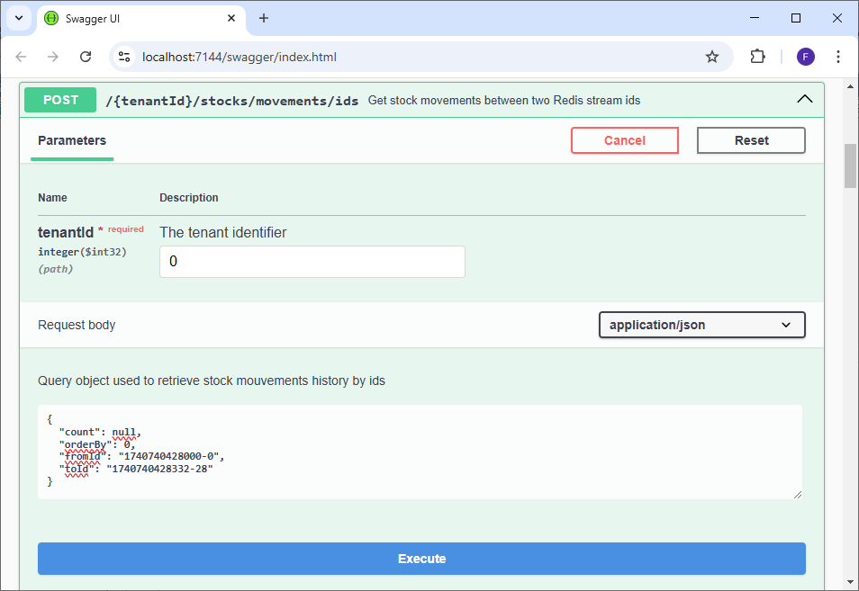

# Historique des mouvements de stock

## Généralités

Le module de traitement des stocks de Unified Stock permet de conserver un historique des stocks reçus depuis les sources d'approvisionnement ou des modules d'intégrations de stocks en les enregistrant dans un stream REDIS sur la base __DB1__. Cet historique permet de garder une trace temporaire des opérations dans Unified Stock et peut-être interrogé afin d'être stocké à long terme ou à des fins de diagnostic.

__Attention :__ l'historique est réinitialisé à chaque fois que le cache REDIS est vidé, il ne s'agit donc pas d'une solution de stockage à long terme.

Cette historisation est automatique et se fait sur réception de nouvelles données de stocks depuis les sources d'approvisionnement, les modules d'intégrations de stocks ou encore les APIs.

Les mouvements de stocks enregistrés dans le stream contiennent :
- La date de l'enregistrement précise à la milliseconde dans REDIS. __Attention, il ne s'agit pas de la date où le mouvement a eu lieu dans l'emplacement.__
- Le rang d'enregistrement. Si plusieurs mouvements sont sauvegardés durant la même milliseconde, cela permet de les classer par ordre d'enregistrement.
- La référence de l'article.
- Le code de l'emplacement.
- Le type d'emplacement.
- La quantité disponible en stock.

__Attention__, seuls les changements de quantités en stocks qui parviennent au module d'intégration des stocks sont effectivement enregistrés.

Dans le cadre de l'exécution des sources d'approvisionnement, seul les stocks considérés comme __valides__ sont envoyés à Unified Stock. De plus la configuration de l'option __UnifiedStockIncludeIgnoredStocks__ influe également sur le nombre de stocks envoyés à US. Pour plus d'information, consultez les sections de documentation dédiées.

De plus si vous constatez des disparités entre les mouvements de stocks dans vos emplacements et ceux historisés par Unified Stock en journée, cela peut indiquer un disfonctionnement de vos modules d'intégrations de stocks spécifiques.

## Points API principaux

Le module de traitement des stocks dispose d'APIs permettant d'interroger l'historique des mouvements de stocks.
Tous les points API sont détaillés dans le swagger et sont accompagnés d'une définition des objets d'envois et de retours.

### Ajout d'entrées dans l'historique

Comme expliqué plus haut, l'historisation des données se fait automatiquement sur réception de nouveaux stocks. Pour insérer de nouveaux stocks dans Unified Stock, consultez la documentation sur les APIs du module de traitement de stocks.

### Lire l'historique entre deux dates

__POST : {tenantId}/stocks/movements/dates__

Ce point API permet d'obtenir les mouvements de stocks entre deux dates (incluses). Pour cela il est nécessaire de passer un objet JSON contenant les champs suivant dans le body de la requête :
- __from__ : la date UTC (incluse) en à partir de laquelle récupérer les mouvements de stocks. Doit être inférieure à __to__.
- __to__ : la date UTC (incluse) jusqu'à laquelle récupérer les mouvements de stocks. Doit être supérieure à __from__.
- __count__ : Permet de limiter le nombre d'entrées à recupérer. Si __count__ a une valeur plus importante que le nombre total de mouvements enregistrés, alors tous les mouvements sont récupérés. Peut être null et n'est pas pris en compte si inférieur ou égal à 0. 
- __orderBy__ : Si __0__, classe les mouvements de stocks du plus ancien au plus récent. Si __1__, classe les mouvements de stocks du plus récent au plus ancien. 

Les champs __count__ et __orderBy__ se cumule :\
Par exemple si __count__ est à 10 et __orderBy__ à 0, Unified Stock va récupérer les 10 premiers mouvements du plus ancien au plus récent à partir de la date __from__.\
Si __count__ est à 10 et __orderBy__ à 1, Unified Stock va récupérer les 10 derniers mouvements du plus récent au plus ancien à partir de la date __to__.

### Lire l'historique entre deux IDs

__POST : {tenantId}/stocks/movements/ids__

Lorsqu'un mouvement de stock est ajouté au stream, REDIS va lui attribuer un identifiant de ce type :\
__1740740428332-28__ où la partie avant le __"-"__ correspond à un Epoch & Unix Timestamp représentant le nombre de millisecondes écoulées depuis le 1 Janvier 1970 à 00h00:00. La partie après le __"-"__ correspond au rang d'insertion dans la base dans le cas où plusieurs mouvements ont été enregistrés durant la même milliseconde.

Ce point API permet de récupérer les mouvements de stocks compris entre deux IDs (incluses). Pour cela il est nécessaire de passer un objet JSON contenant les champs suivant dans le body de la requête :
- __fromId__ : l'ID à partir de laquelle récupérer les mouvements de stocks. Doit être inférieure à __toId__. Si l'ID demandée n'existe pas en base, l'ID suivante existante en base sera utilisée. Il est également possible de renseigner "-" pour choisir la toute première ID enregistrée (la plus ancienne).
- __toId__ : l'ID jusqu'à laquelle récupérer les mouvements de stocks. Doit être supérieure à __fromId__. Si l'ID demandée n'existe pas en base, l'ID précédente existante en base sera utilisée. Il est également possible de renseigner "+" pour choisir la toute dernière ID enregistrée (la plus récente).

Les champs __count__ et __orderBy__ ont un comportement identique à la lecture d'historique par dates.

### Obtenir le nombre d'entrées dans l'historique

__GET : {tenantId}/stocks/movements/length__

Ce point API permet de récupérer le nombre de mouvements de stocks actuellement enregistrés dans le stream REDIS. Il peut être utilisé à des fins de diagnostic ou pour savoir s'il est nécessaire de supprimer les anciennes entrées.

### Raccourcir la taille de l'historique

__DELETE : {tenantId}/stocks/movements/trim/{maxLength}__

Ce point API permet de raccourcir l'historique en supprimant les entrées les plus anciennes si leur nombre dépasse le paramètre entier positif __maxLength__. Il permet également de vider entièrement l'historique si __maxLength__ est égal à 0.

Renvoie le nombre d'entrées supprimées.