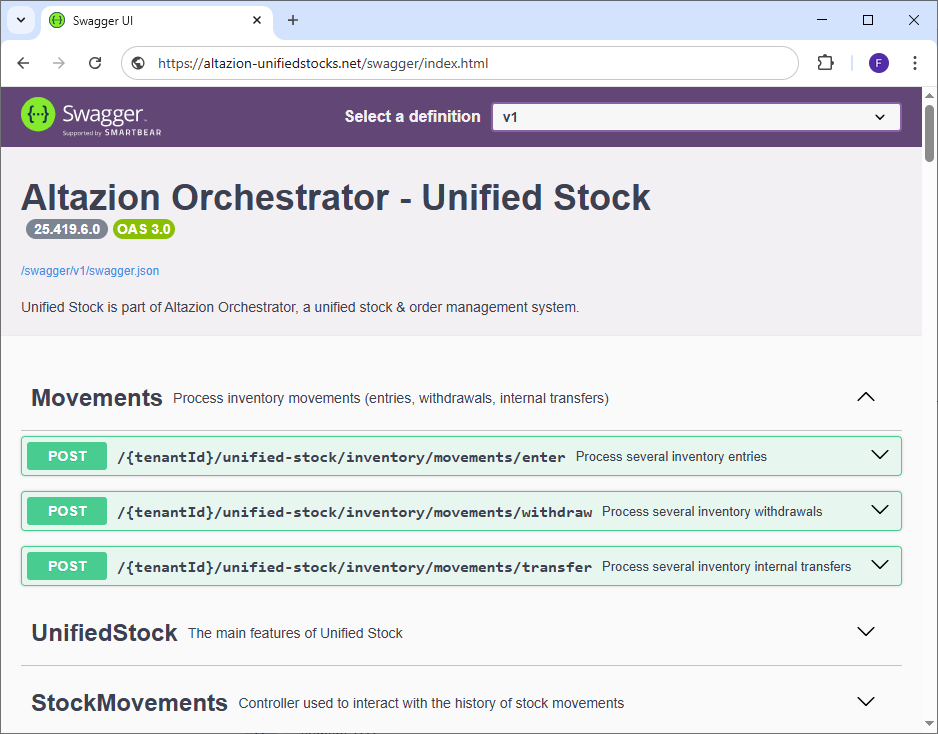
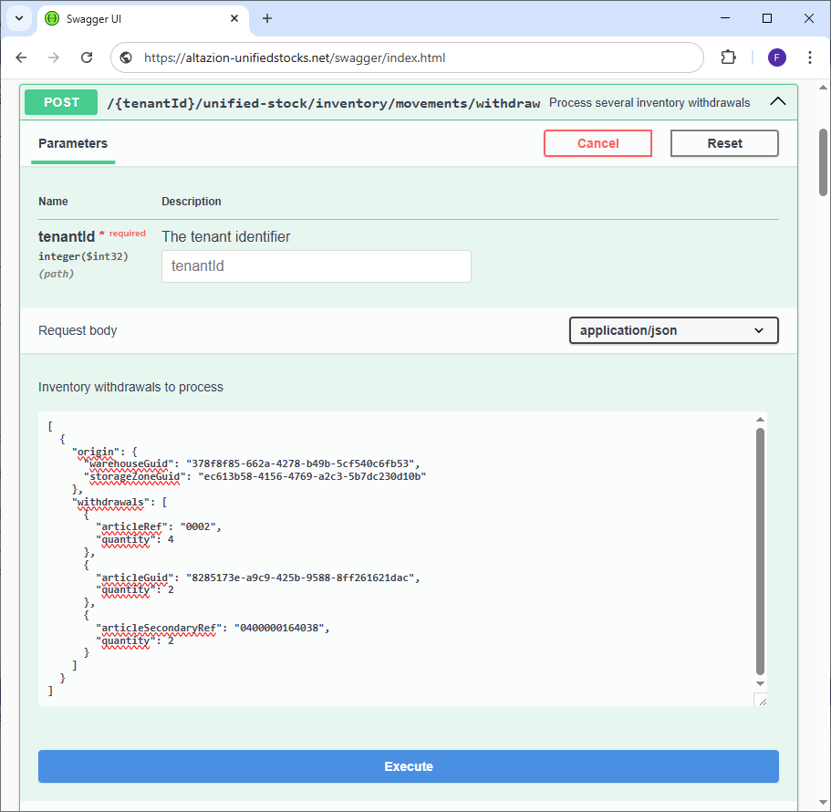

# Mouvements de stocks

## Généralités

Le module Unified Stock vous permet de réaliser facilement des mouvements de stocks depuis vos entrepôts (magasins, dépôts, etc.).
Trois types de mouvements sont réalisables :
- Des entrées de stocks dans une zone de stockage
- Des sorties de stocks depuis une zone de stockage
- Des transferts de stock depuis une zone vers une autre qui peut se trouver dans un autre entrepôt.

À noter qu'il est possible de transférer du stock d'un type d'entrepôt à un autre. Vous pouvez par exemple transférer du stock depuis un dépôt vers un magasin et inversement. De plus chaque mouvement de stocks entraîne automatiquement le recalcul de la __valorisation du stock__ en fonction du type de stockage de l'article (__PUMP__ : Prix Unitaire Moyen Pondéré ou __FIFO__ : First In First Out).

Pour effectuer des mouvements de stocks, plusieurs options s'offrent à vous :

- Utiliser les pages web de back-office dédiées aux mouvements de stocks.
- Utiliser l'application android de gestion des stocks Altazion.
- Appeler directement les points API du module Unified Stock.

Cette documentation se concentre sur ce troisième point.

## Points API

### Présentation

Comme décrit plus haut, le module de traitement des stocks dispose d'APIs permettant d'effectuer des mouvements de stocks.
Tous les points API sont détaillés dans le swagger et sont accompagnés d'une définition des objets d'envoi et de retour.



Ces points sont accessibles via l'URL suivante :

{UrlDeUnifiedStock}/{votreRaisonJuridique}/unified-stock/inventory/movements/{typeDeMouvement}

Il existe trois types de mouvements :
- __enter__ pour les entrées de stock
- __withdraw__ pour les sorties de stock
- __transfer__ pour les transferts

Ainsi une url complète pour un client ayant accès au site "altazion-unifiedstocks.net", dont la raison juridique est "1" et qui souhaite réaliser des sorties sera :

https://altazion-unifiedstocks.net/1/unified-stock/inventory/movements/withdraw

Dans les trois cas, la requête envoyée à Unified Stock devra être de type __POST__ car le module s'attend à recevoir un tableau d'objets au format JSON dans le body contenant les mouvements à réaliser. Unified Stock est conçu pour pouvoir traiter plusieurs mouvements de stocks du même type à la fois (plusieurs entrées, sorties, transferts), c'est pour cela qu'un tableau est demandé dans le body des requêtes API. Dans le cas où vous n'avez qu'un seul mouvement à réaliser, il est possible de ne mettre qu'un seul élément dans le tableau.

Enfin, les objets à envoyer sont conçus pour être très similaires afin de simplifier un maximum leur intégration dans votre SI.

### Sorties de stock

__POST : {tenantId}/unified-stock/inventory/movements/withdraw__



Ce point API permet de traiter plusieurs sorties de stock. Pour cela il est nécessaire de passer un tableau d'objets JSON contenant chacun les champs suivants dans le body de la requête.

#### origin

Il sert à identifier l'endroit duquel les stocks sont retirés et contient :
- Le champ __warehouseGuid__ permettant d'identifier l'entrepôt.
- Le champ __storageZoneGuid__ permettant d'identifier la zone de stockage dans l'entrepôt où se trouve le stock à prélever.

__Attention__ : Les deux champs sont obligatoires.

#### withdrawals

Il s'agit d'un tableau permettant d'identifier les articles auxquels retirer du stock ainsi que les quantités à prélever.

Il est possible d'identifier un article via :
- __articleRef__ : La référence interne courte de l'article en base de données. Ces références sont le plus souvent saisies par l'utilisateur.
- __articleGuid__ : L'identifiant unique interne de l'article en base de données. Ces identifiants sont le plus souvent utilisés pour la communication entre machines.
- __articleSecondaryRef__ : Une autre façon d'identifier l'article tel qu'un EAN13 par exemple. Ce type de référence est le plus souvent scanné.

__Attention__ : Au moins l'un des identifiants doit être renseigné. Plusieurs types d'identifiants peuvent coexister.

Le champ __quantity__ permet quant à lui de définir les quantités de stock à retirer pour l'article voulu.

Voici ci-dessous un exemple d'appel contenant une sortie de stock. Cette sortie contient 3 lignes de stock à prélever :

```json
[
  {
    "origin": {
      "warehouseGuid": "378f8f85-662a-4278-b49b-5cf540c6fb53",
      "storageZoneGuid": "ec613b58-4156-4769-a2c3-5b7dc230d10b"
    },
    "withdrawals": [
      {
        "articleRef": "0002",
        "quantity": 4
      },
      {
        "articleGuid": "8285173e-a9c9-425b-9588-8ff261621dac",
        "quantity": 2
      },
      {
        "articleSecondaryRef": "0400000164038",
        "quantity": 2
      }
    ]
  }
]
```