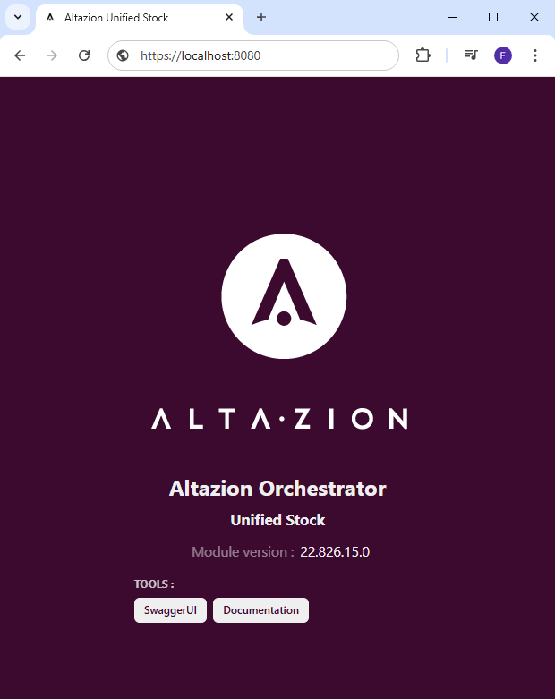
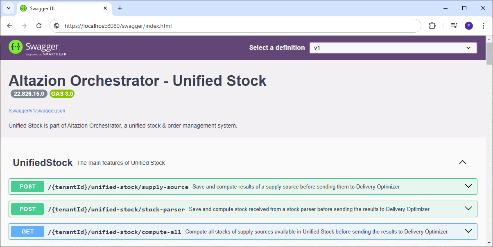
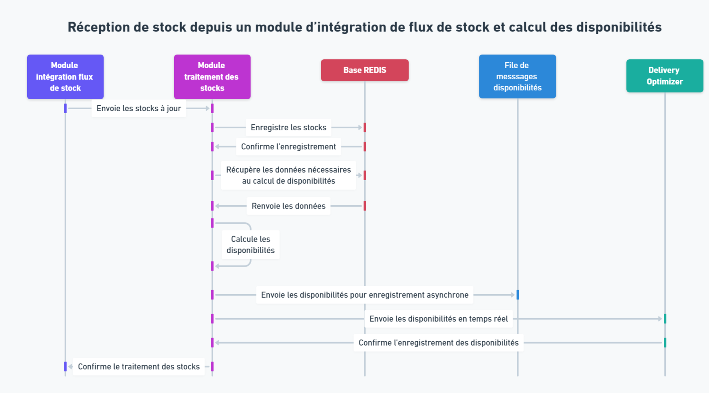

# Présentation du module de traitement des stocks

## Généralités

### Définition

Le module de traitement des stocks se présente sous forme d’un serveur API à déployer dans votre solution. Il a vocation à être appelé les autres composants de l'OMS tel que les sources d'approvisionnement ou les modules d'intégration des flux de stock.

Lorsque vous utilisez Unified Stock, le module de traitement des stocks est considéré comme le référentiel des stocks. C'est à dire qu'il dispose, via sa base REDIS, des informations les plus à jour sur les stocks.

Outre ses fonctions d'agrégateur de stock, ce module sert également à recalculer les disponibilités à chaque réception de mouvement de stock depuis un module d'intégration de flux de stocks ou après le calcul des sources d'approvisionnement. Une fois ces disponibilités recalculées, elles sont envoyées à Delivery Optimizer et transmises à une file de messages pour enregistrement asynchrone dans la base de données SQL principale.

### Déploiement
Le module Altazion de traitement des stocks est distribué sous forme d’un container Docker et peut ainsi être déployé facilement sur tous les environnements compatibles. Il expose le port 8080 par défaut. Pour vérifier son bon déploiement il est possible de se rendre sur l’URL du module qui devrait renvoyer la page suivante.

À partir de là, il est possible de cliquer sur les boutons de la section « Tools » afin de se rendre sur les pages correspondantes.

### Swagger
Le serveur API exporte un swagger respectant la norme OpenAPI 3.0.1 à l’adresse "/swagger/v1/swagger.json"

Il dispose également d'une interface web SwaggerUI permettant de facilement tester les points API disponibles ainsi que de consulter le détail des objets en entrée/sortie. Cette interface est disponible à l’adresse "/swagger". Enfin il permet également de consulter le détail, les définitions et la structure de tous les objets que vous pourriez être amené à manipuler en utilisant le module.

## Composition des stocks

Chaque stock manipulé par le module de traitement est partagé en deux entités, les informations d'approvisionnement et les quantités de stocks. Si un stock ne possède pas ces deux entités, il sera exclu des algorithmes de calcul de disponibilités.

### Information d'approvisionnement

Chaque stock (combinaison origine de stock/article) dispose d'informations issues directement de l'exécution des sources d'approvisionnement, à savoir :
- À quelle règle appartient le stock
- Si le stock est ignoré par un traitement
- Si le stock possède une quantité minimale à atteindre pour être pris en compte
- Si le stock possède une quantité maximale à ne pas dépasser pour être pris en compte

Ces informations sont envoyées à Unified Stock à la fin de l'exécution des sources d'approvisionnement.

### Quantités de stocks

La seconde entité est composée de toutes les différentes quantités de stocks :
- Les stocks disponibles
- Les stocks retirés
- Les stocks totaux (stocks disponible + stocks retirés)

Ces informations sont mises à jour en temps réel grâce aux stocks reçus depuis les modules d'intégration des flux de stock.

Ils peuvent également être mis à jour depuis les sources d'approvisionnement si vous avez choisi de considérer ces dernières comme une source fiable de stocks.

## Point API principaux

Outre des points API servant à interagir avec les données présentes dans REDIS, le module de traitement des stocks dispose de trois point API principaux trouvables dans la partie "Unified Stock" du swagger.

### Calcul complet des disponibilités à la réception d'un résultat de Source d'Approvisionnement

__POST : {tenantId}/unified-stock/supply-source__

Cette méthode permet d'enregistrer les résultats de l'exécution d'une source d'approvisionnement dans la base REDIS de Unified Stock. Elle exécute un calcul complet des disponibilités sur les stocks reçus en parallèle avant d'envoyer le résultat à Delivery Optimizer. Les disponibilités sont également envoyés vers la file de message pour enregistrement asynchrone dans la base de données SQL.

Un status code 200 "OK" est renvoyé après son exécution.

Pour plus d'informations sur le traitement d'exécution des sources d'approvisionnement dans le cadre de Unified Stock, consultez la page de documentation dédiée.

### Calcul partiel des disponibilités sur réception de stock à jour

__POST : {tenantId}/unified-stock/stock_parser__

Cette méthode permet d'enregistrer les stocks à jour reçu d'un module d'intégration de flux de stock dans la base REDIS. Il fois cela fait, elle exécute un calcul des disponibilités sur les nouveaux stocks avant d'envoyer le résultat à Delivery Optimizer. Les disponibilités sont également envoyés vers la file de message pour enregistrement asynchrone dans la base de données SQL.

Un status code 200 "OK" est renvoyé après son exécution.

Le diagramme de séquence ci-dessous décrit le processus complet :

