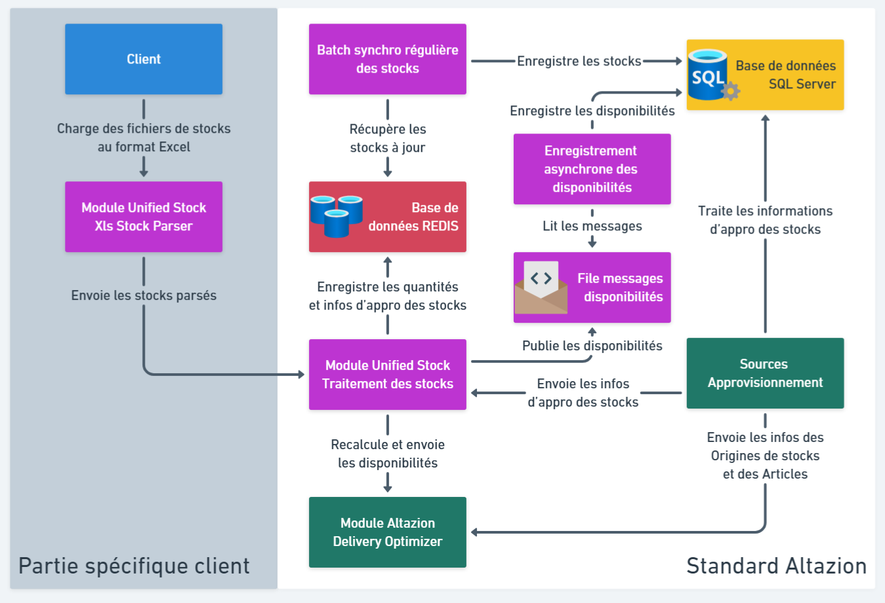

# Présentation du produit

## Généralités

### Présentation

Unified Stock (US) est l'un des composants d'Orchestrator, l'OMS d'Altazion. Il s'agit d'une suite d'applications à déployer dans votre système d'information qui offre deux fonctionnalités clefs :
- Bénéficier des stocks en temps réel pour l'ensemble de vos origines de stock et de vos canaux de ventes.
- Permettre un recalcule en temps réel de stocks disponibles à la vente (disponibilités) sur vos différents canaux.

On parle de stocks en temps réel car l'intégration d'un mouvement de stock dans Unified Stock et le recalcule des disponbilités prend rarement plus d'une seconde.

Ce produit est conçu pour fonctionner avec les Sources d'Approvisionnement et Delivery Optimizer. Il est donc indispensable d'utiliser ces derniers pour bénéficier des avantages offerts par Unified Stock.

Pour plus d'information sur Delivery Optimizer et les Sources d'Approvisionnement, consultez les pages de documentations qui leurs sont dédiées.

### Configuration

Pour utiliser Unified Stock, vous devrez configurer quatre options système :

- __UnifiedStockUrl__, qui correspond à l'adresse de votre module de traitement des stocks (voir page de documentation dédiée)
- __UnifiedStockCredentials__, qui contient les identifiants de connexion au module de traitement des stocks (voir page de documentation dédiée)
- __UnifiedStockIncludeAvailabilities__, il s'agit d'un booléen qui s'il est à "true" considère que les quantités de stocks contenu dans la base de données SQL au moment de l'exécution des sources d'approvisionnement sont corrects. Dans ce cas, ils seront transférés à Unified Stock une fois le calcul des sources d'approvisionnement terminé.
- __UnifiedStockIncludeIgnoredStocks__, il s'agit d'un booléen qui s'il est à "true" permet l'envoi des stocks exclus par les règles d'approvisionnement au module de traitement. Cette option est désactivée par défaut car gourmande en ressources et inutile pour le calcul des disponibilités. L'activer peut toutefois être utile durant les phases de tests du produit. __Altazion recommande de désactiver cette option en production__.

## Architecture de Unified Stock

Le produit Unified Stock est composé de plusieurs modules, d'un ensemble de traitements ainsi que d'une base de données REDIS que nous allons maintenant détailler.

### Module(s) d'intégration (parsage) des flux de stock
Cette partie spécifique sert à interfacer vos flux de stock avec le module de traitement des stocks de Unified Stock afin qu'ils respectent le standard d'Altazion. Concrètement, il s'agit d'un ou plusieurs module(s) dédié(s) à faire de l'échange de données informatisées (EDI).

Le fonctionnement des flux de stock étant unique pour chaque client, n'hésitez pas à vous rapprocher d'Altazion Services pour le développement de votre/vos module(s).

Altazion propose un module d'intégration des flux de stocks basé sur le parsage de fichiers aux formats Excel (xls, xlsx) vous permettant de facilement tester le fonctionnement de Unified Stock.
Pour plus d'informations sur ce module, consultez la page de documentation dédiée à Xls Stock Parser.

### Module de traitement des stocks
Il s'agit d'un serveur API conçu pour réceptionner les mouvements de stocks depuis votre système d'information et les caractéristiques des stocks en provenance des sources d'approvisionnement afin de recalculer les disponibilités en temps réel. Les disponibilités recalculées sont envoyées directement à Delivery Optimizer et publiées sur une file de messages pour être enregistrée de façon asynchrone dans la base de donnée SQL principale. 

Pour plus d'informations sur ce module, consultez la page de documentation dédiée.

### Base de données REDIS

Unified Stock utilise une base de données REDIS classique (REDIS Stack n'est pas nécessaire) pour le stockage des stocks. Cette base ayant un rôle central, les performances de cette dernière ont un impact direct sur celle de Unified Stock et sur sa réactivité.

__Attention :__ REDIS étant une base mémoire, Altazion recommande vivement de définir une politique de sauvegarde périodique afin d'éviter toutes pertes de données éventuelles dû à un redémarrage de la base.

### Traitement de synchronisation régulière des stocks

Unified Stock dispose d'un batch permettant d'enregistrer régulièrement en base SQL les stocks modifiés depuis la dernière synchronisation.

Ce batchs se déclenche toutes les 30 secondes mais la synchronisation ne s'exécute que si au moins une de ces deux conditions est rencontrée :
- Le nombre de stocks modifiés doit atteindre ou dépasser un certain seuil. Par défaut à 1000, ce seuil est paramétrable via la variable d'environnement __"SYNC_IMSTOCK_DB_THRESHOLD"__.
- Un certain temps en secondes s'est écoulé depuis la dernière synchro. Par défaut à 600 secondes (10 minutes), ce temps est paramétrable via la variable d'environnement __"SYNC_IMSTOCK_DB_TIME_TRIGGER"__.

La combinaison de ces deux conditions permettent de faire en sorte que les stocks en base de données soient mis à jour suffisament régulièrement, même si peu de stocks sont modifiés durant une certaine période.

### Enregistrement asynchrone des disponibilités

Après le calcul des disponibilités le module de traitement des stocks publie les résultats dans une file de messages. Cette file est lue par un programme chargé de synchroniser les disponibilités avec celles de la base de données SQL principale.

Cette synchronisation a lieu de façon asynchrone car on considère que Delivery Optimizer (qui lui est mis à jour en temps réel), est le référentiel des disponibilités. La table en base de données est principalement mise à jour afin de permettre une consultation informative des disponibilités.

### Schéma de l'architecture de Unified Stock

Le schéma ci-dessous représente l'architecture complète de Unified Stock. Les composants Unified Stock sont colorés en violet, les autres composants de l'OMS sont en vert :

À noter que ce schéma utilise le module d'intégration des flux de stocks Xls Stock Parser fourni par Altazion. La configuration de la partie en gris (partie spécifique client) est propre à chaque client et différera donc de celle du schéma.