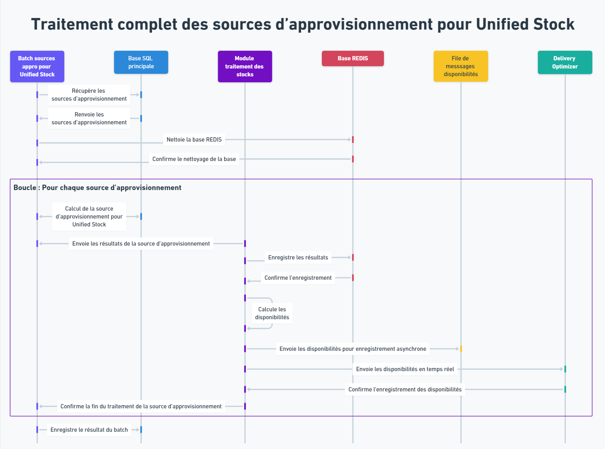

# Sources d'Approvisionnement pour Unified Stock

Cette page traite du fonctionnement des Sources d'Approvisionnement avec Unified Stock. Assurez-vous d'avoir lu la documentation générale sur les Sources d'Approvisionnement avant de lire cette partie.

## Généralités

L'une des fonctionnalités principales de Unified Stock est de permettre le recalcul en temps réel des disponibilités. Concrètement, lorsque Unified Stock est paramétré, la partie de calcul des disponibilités dans les sources d'appro ne s'exécute pas et est à la place déportée vers Unified Stock. Pour ce faire Unified Stock va s'appuyer sur des informations d'approvisionnement reçues depuis les Sources d'Approvisionnement après leur déclenchement.

Ces informations sont reçues via le point API suivant :

__POST : {tenantId}/unified-stock/supply-source__

## Traitement périodique (batch) de recalcul complet des Sources d'Approvisionnement

Lorsque Unified Stock est activé et paramétré, le processus de recalcul complet des Sources d'Approvisionnement fonctionne de la façon suivante :

