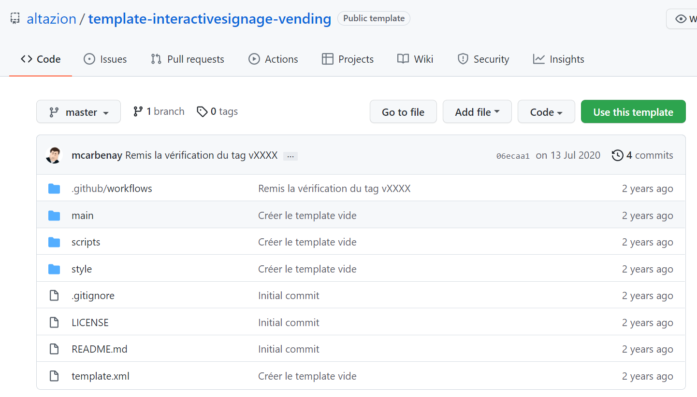
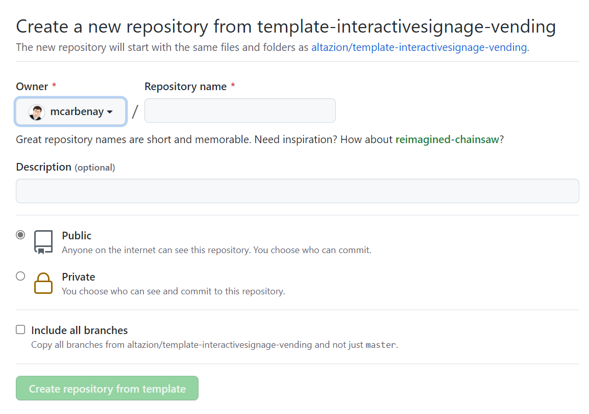

# Créer un Template 

## Créer un template sous forme d'un projet Github

1) Créer un projet à partir du template github correspondant à votre application. Par exemple pour les bornes de vente : [template-interactivesignage-vending](https://github.com/altazion/template-interactivesignage-vending).




2) ce template contient les fichiers minimaux pour réaliser un template :

    - `template.xml` décrit le template et ses options
    - `styles/style.css` contient le style

3) Clonez cette repo sur votre poste de développement
4) modifiez les informations générales du template dans la partie "haute" du fichier template.xml.
```xml
  <Name>{{git_repo_name}}</Name>
  <Description></Description>
  <Author>{{git_repo_owner}}</Author>
  <BasedOn>Vending</BasedOn>
```
5) Vous pouvez ensuite commencer à développer votre template, en fonction de l'application que vous ciblez :

- Pour les [bornes de ventes](vending/templates-vending.md)
- Pour les bornes d'accueil
- etc.

## Ajouter les fichiers et les référencer

- créer un ou plusieurs dossiers avec vos fichiers html, css,js 
- placer vos ressources fichiers dans un autre sous-dossier du projet.

Par exemple :

```
 /
 ----/main
     ----/homepage.html
     ----/product.html
 ----/style
     ----/style.css
 ----/scripts
     ----/app.js
 ----/resources
     ----/logo.png              
```

- référencer tous ces dossiers et leur contenu dans le fichier template.xml

```xml
    <Shared kind="Resources">
      <Folder path="main" />
    </Shared>
    <Shared kind="HTML">
      <Folder path="main" />
    </Shared>
    <Shared kind="CSS">
      <Folder path="style" />
    </Shared>
    <Shared kind="JS">
      <File path="scripts/app.js"/>
    </Shared>
```

Il existe 4 types d'imports :

- HTML
- CSS
- JS
- Resources

A l'exception du type "Resources", lorsque vous utilisez un type particulier pour une référence de dossier, seuls les fichiers correspondant à ce type sont inclus. Par exemple, si vous définissez `kind="HTML"`, seuls les fichiers .html seront intégrés, un fichier .png situé dans ce même dossier sera ignoré.

## Permettre de configurer votre template


## Créer des variations de thèmes


